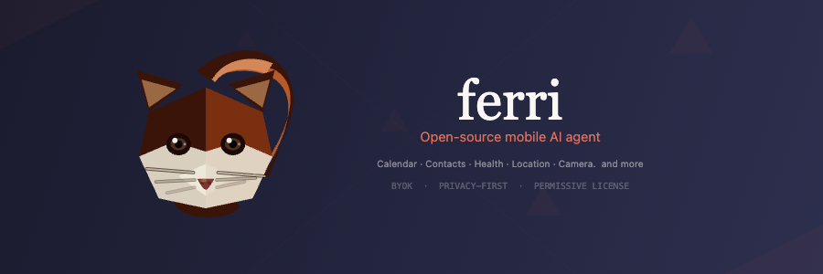
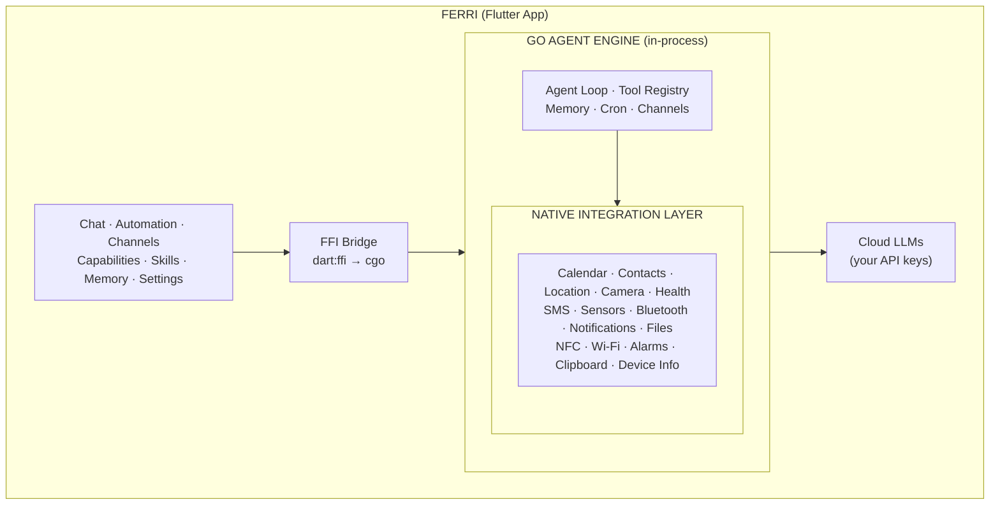

<p align="center">
  
</p>

<p align="center">
  <strong>An open-source AI agent that lives inside your phone — not just on it.</strong><br>
  <sub>Calendar. Contacts. Health. SMS. Location. Camera. Bluetooth. Automations. 79+ native tools. One conversation.</sub>
</p>

<p align="center">
  <a href="#the-problem">Why</a> &middot;
  <a href="#what-ferri-can-do">Capabilities</a> &middot;
  <a href="#how-it-works">Architecture</a> &middot;
  <a href="#getting-started">Install</a> &middot;
  <a href="#roadmap">Roadmap</a> &middot;
  <a href="#contributing">Contribute</a>
</p>

<p align="center">
  
  
  
  
  
</p>

<!-- TODO: Add demo GIF/screenshot showing real tool calls -->

> **Early Access** — Ferri is being published to the Google Play Store for testing. If you'd like to try it without building from source, [register interest on our website](https://ferriapp.ai) to get access.

---

<h2 id="the-problem">Two Worlds That Don't Talk to Each Other</h2>

There are two kinds of AI on your phone today — and neither one is enough.

**Frontier AI apps** (ChatGPT, Claude, Gemini) have world-class reasoning. They can analyze documents, write code, explain anything. But they can't act on your physical world. They can't remind you to buy milk when you're near the grocery store, check who called while you were in a meeting, or pull up your workout plan when you walk into the gym.

**Phone assistants** (Siri, Google Assistant, Bixby) have deep OS access. They can set alarms, read messages, make calls, control smart home devices. But their AI capabilities are limited — rigid command-response, poor at multi-step reasoning, locked to one ecosystem, and they can't chain actions together intelligently.

```
Frontier AI apps:   Brilliant reasoning  ◄── gap ──►  Blind to your life
Phone assistants:   Deep phone access    ◄── gap ──►  Limited intelligence
```

Nobody bridges both. That's where Ferri sits.

**Ferri connects any frontier LLM to your phone's native capabilities.** It embeds a Go-based agent engine directly inside a native mobile app, registering your phone's actual APIs — calendar, contacts, location, camera, health data, sensors, messages, and more — as callable tools in the AI agent loop.

The LLM reasons. Your phone acts. You see everything.

---

## The Difference

```
 AI chatbot apps            Phone assistants          Ferri
 ───────────────            ────────────────          ─────

 "I don't have access       "Setting timer for        "You have a dentist at
  to your calendar."         10 minutes."              3pm. Your last visit
                                                       was 6 months ago.
 "I can't check your        "Reading your last         Want me to remind you
  messages."                  message from Mom."        30 minutes before?"

 "I don't know where        "You're on Main St."      "Marco called twice
  you are."                                             during your 2pm
                             Can access your phone.     meeting. He's in your
 Brilliant reasoning.        Can't reason about it.     contacts — want me
 No phone access.            Can't chain actions.       to text him back?"
                             One command at a time.
                                                       Any LLM. Full phone
                                                       access. Multi-step
                                                       reasoning. Open source.
```

---

## Where Ferri Fits

|  | AI Reasoning | Phone API Access | Multi-Step Actions | Open Source | Any LLM |
|--|:-:|:-:|:-:|:-:|:-:|
| **AI chatbot apps** (ChatGPT, Claude) | Frontier | Minimal to none | Yes (in chat) | No | No |
| **Phone assistants** (Siri, Google Assistant) | Basic | Deep OS access | No (single command) | No | No |
| **AI hardware** (Rabbit r1, Humane Pin) | Varies | Limited | Partial | No | No |
| **CLI agents** (PicoClaw) | Any LLM | No phone APIs | Yes | Yes | Yes |
| **Ferri** | **Any LLM** | **Full (79+ tools)** | **Yes** | **Yes** | **Yes** |

---

<h2 id="what-ferri-can-do">What Ferri Can Do</h2>

Ferri registers 28+ native capabilities as callable tools in the agent loop. The LLM decides which to invoke, sees the results, and chains actions together — all visible in the chat UI.

| Capability | What the AI Can Do | Example |
|---|---|---|
| **Calendar** | Read, create, update, delete events | *"Find a 90-minute slot next week for a call with Marco"* |
| **Contacts** | Search, read, create, update contacts | *"Who called me while I was in the meeting?"* |
| **Location** | GPS coordinates, geocoding, reverse geocoding | *"How far am I from the office right now?"* |
| **Health** | Steps, heart rate, sleep, weight, calories (Health Connect) | *"I've been sleeping badly — what does my data show?"* |
| **SMS** | Read inbox, send messages | *"Read my last 5 messages and summarize"* |
| **Call Log** | Read recent calls with timestamps | *"Did anyone call while I was in my meeting?"* |
| **Bluetooth** | Scan and list nearby devices | *"What Bluetooth devices are nearby?"* |
| **Alarms** | Set alarms and timers | *"Set an alarm for 6:30am tomorrow"* |
| **Camera** | Capture photos | *"Take a photo of this whiteboard"* |
| **Notifications** | Send notifications, read notification history | *"Summarize my notifications from the last hour"* |
| **Clipboard** | Read and write clipboard | *"Copy that tracking number to my clipboard"* |
| **Device Info** | Battery, connectivity, flashlight, brightness | *"What's my battery level?"* |
| **App Launcher** | Open any installed app | *"Open Spotify"* |
| **Files** | Read and write to workspace | *"Save that summary to a file"* |
| **Web Search** | Search via Brave, DuckDuckGo, or Perplexity | *"Search for the latest Flutter 4 release notes"* |
| **Web Fetch** | Fetch and extract content from URLs | *"Summarize this article for me"* |
| **Reminders** | Set time-based reminders | *"Remind me to call the dentist at 5pm"* |
| **Wi-Fi** | Scan networks, get connection info | *"What Wi-Fi network am I connected to?"* |
| **NFC** | Read NFC tags | *"Read this NFC tag"* |
| **Sensors** | Accelerometer, gyroscope, magnetometer | *"Is the phone lying flat?"* |

**Every tool call is visible in the chat UI.** You see exactly what the AI accessed. No hidden data access. No surprises.

---

## Features

- **Agent loop, not a chat wrapper** — the LLM calls tools, sees results, and decides what to do next
- **28+ native capabilities** with 79+ tools registered as callable with structured JSON results
- **Streaming chat** with real-time token display and tool call cards
- **Skills system** — teach the AI specialized workflows via SKILL.md files (ships with 5 built-in skills)
- **Automation** — cron jobs and geofence triggers that run agent prompts on schedule or by location
- **Channels** — connect Telegram, Discord, or Slack as external chat interfaces
- **Heartbeat** — periodic check-ins where the AI proactively reviews your data
- **Persistent memory** — the AI remembers context across conversations
- **Persistent chat log** — full conversation history with tool call details, survives app restarts
- **7+ LLM providers** — OpenRouter, Anthropic, OpenAI, Groq, DeepSeek, SambaNova, Google Gemini, plus any OpenAI-compatible endpoint
- **Configurable web search** — Brave Search (API key), DuckDuckGo, or Perplexity as web search backends

---

<h2 id="how-it-works">How It Works</h2>

Ferri embeds a Go agent engine (`libferri.so`) inside the Flutter app via `dart:ffi`. The engine runs the full agent loop locally: prompt the LLM, parse tool calls, dispatch them through Dart to native APIs, feed results back, repeat.



**When you ask Ferri something**, the agent loop decides which tools to call. If it calls `calendar_read_events`, the native integration layer fires the appropriate platform channel call to Android's CalendarProvider, returns the data to Go, and the agent incorporates it into its response — all in ~5-50ms, fully on-device.

### Key Technical Decisions

- **Go engine** — the agent loop, tool registry, memory, cron, and channels are all Go. Compiled to a C-ABI shared library (`libferri.so`) via cgo. Same engine can run on any platform.
- **Flutter** — true cross-platform UI with the cleanest Go interop story (`dart:ffi` → cgo, zero bridge overhead).
- **NativePort callbacks** — streaming tokens and tool dispatch results flow from Go → Dart without polling.
- **Platform channels** — each native capability (Calendar, Contacts, etc.) is a Kotlin/Swift platform channel that the Go engine invokes through Dart.
- **Riverpod** — state management for the entire app.

---

## Security & Privacy

An AI agent with access to your calendar, contacts, health data, and messages has to earn trust. Ferri is early-stage software — we are **not** claiming it is fully secure. What we are doing is building in the open so the community can audit, challenge, and harden every layer.

That's the point of open-sourcing this. A secure mobile AI agent ecosystem won't come from one team — it'll come from a community that cares about getting it right.

**What Ferri does today:**

- **On-device processing.** The Go engine runs inside the app process. Your data is processed locally and never sent to a Ferri server — because there isn't one.
- **BYOK (Bring Your Own Key).** You connect directly to the LLM provider of your choice. No accounts, no intermediary.
- **No telemetry.** Zero analytics. Zero tracking. Zero data collection.
- **HTTPS enforced.** Network security configuration blocks cleartext traffic. Only LLM API calls leave the device, over TLS.
- **API keys in secure storage.** Credentials stored in Android Keystore / iOS Keychain via `flutter_secure_storage`.
- **Granular capability opt-in.** Each capability (Calendar, Contacts, SMS, etc.) is independently toggleable. Grant only what you're comfortable with.
- **Transparent tool calls.** Every tool invocation is shown in the chat UI. You see exactly what the AI accessed.

**Where we need the community's help:** permission flow audits, data handling edge cases, prompt injection hardening, secure defaults review, and threat modeling for on-device agents. If you think adversarially about software, we want you involved. See [Contributing](#contributing).

---

<h2 id="getting-started">Getting Started</h2>

### Prerequisites

- **Flutter** 3.22+ ([install](https://docs.flutter.dev/get-started/install))
- **Go** 1.22+ ([install](https://go.dev/dl/))
- **Android SDK** API 24+ with NDK 28.x
- **Android device or emulator** (arm64 or x86_64)

### 1. Clone

```bash
git clone https://github.com/ferri-ai/ferri.git
cd ferri
```

### 2. Set up Android SDK paths

```bash
export ANDROID_HOME=$HOME/Library/Android/sdk        # or ~/Android/Sdk on Linux
export NDK_HOME=$ANDROID_HOME/ndk/28.2.13676358      # your NDK version
```

### 3. Build the Go engine

```bash
NDK_HOME=$NDK_HOME make build-engine-android-arm64
```

This cross-compiles `libferri.so` and places it in `android/app/src/main/jniLibs/arm64-v8a/`.

For x86 emulators:
```bash
NDK_HOME=$NDK_HOME make build-engine-android-x86
```

### 4. Get Flutter dependencies

```bash
flutter pub get
```

### 5. Run

```bash
flutter run
```

On first launch, Ferri asks you to pick an LLM provider and enter your API key. After that, you're in.

### Build Targets

```bash
make build-engine-android-arm64    # Go engine for physical devices
make build-engine-android-x86      # Go engine for x86 emulators
make test                          # Run Go engine tests
make lint                          # Lint Go engine
flutter test                       # Run Flutter tests
flutter build apk --debug          # Build debug APK
flutter build apk --release        # Build release APK
```

---

## Project Structure

```
lib/                    # Flutter/Dart app (UI, providers, state)
  screens/              # Chat, Automation, Channels, Settings, Onboarding
  providers/            # Riverpod state management
  engine/               # FFI bindings to Go engine
  native/               # Platform channel interfaces (Calendar, Contacts, etc.)
  theme/                # Colors, typography
engine/                 # Go agent engine (libferri)
  core/                 # Agent loop, tools, providers, skills, channels, memory
  mobile/               # C-ABI bridge for mobile FFI
android/                # Android-specific code (Kotlin)
  app/src/main/kotlin/  # Platform channels (Calendar, Contacts, Health, etc.)
assets/                 # Bundled skills, provider metadata
docs/                   # Architecture docs, capabilities reference, plans
```

---

## Skills

Skills are SKILL.md files that teach the AI specialized workflows. Ferri ships with built-in skills and you can create your own.

**Built-in skills:**
- **Daily Health Check** — reviews your health data trends
- **Travel Assistant** — helps with location-aware travel planning
- **Morning Briefing** — daily digest of calendar, messages, and weather
- **Meeting Prep** — prepares you for upcoming meetings
- **Skill Creator** — helps you create new custom skills

**Create your own:**
- **In chat:** Ask Ferri *"Create a skill that helps me track my workouts"*
- **Manually:** Add a folder with a `SKILL.md` file to your workspace's `skills/` directory

Skills are pure instructions — no code execution. The AI reads them on demand and follows the workflow.

---

<h2 id="roadmap">Roadmap</h2>

Ferri is under active development. Here's where we're headed.

| Feature | Description |
|---------|-------------|
| **iOS** | Port all 28+ Android capabilities to iOS (EventKit, CNContact, CLLocation, HealthKit, etc.) |
| **Memory redesign** | Move from append-only memory to a consolidation pipeline — the AI periodically reviews and compresses its memory, promoting important facts and decaying stale context |
| **Progressive capability loading** | Lazy-load tool definitions based on conversation context instead of dumping all 79+ into the system prompt. Critical for smaller, cheaper models |
| **More communication channels** | Expand beyond Telegram, Discord, and Slack to support additional external chat interfaces |
| **External bot communication** | Let Ferri talk to other AI agents and bots — delegate tasks, query specialized services, or orchestrate multi-agent workflows across platforms |
| **On-device LLM** | Run small open-source models locally via on-device inference. A Ferri that needs no API key and no internet connection |

---

<h2 id="contributing">Contributing</h2>

The goal is to build the best open-source AI agent ecosystem for mobile phones — one that is secure, transparent, and actually works. That takes more than one team. It takes a community.

### High-Impact Areas

**Security Audits & Hardening** — This is the most important area. An AI agent with access to your phone needs to be airtight. Review permission flows, audit data handling paths, test for prompt injection, model threat scenarios for on-device agents. If you break things for a living, we want you here.

**iOS Platform Channels** — The single biggest feature contribution opportunity. Every Android capability needs an iOS equivalent. If you know Swift and Apple's frameworks (EventKit, CNContact, CLLocation, HealthKit, HomeKit), you can directly port capabilities. Each one is self-contained.

**New Capabilities & Tools** — Have an Android API that would be useful as an AI tool? Camera OCR, app usage stats, smart home control, accessibility automation — the architecture supports it. Each capability is a self-contained platform channel + tool registration.

**Skills** — Create and share SKILL.md workflows. A good skill is worth more than a code change — it teaches the AI new behaviors that every user benefits from.

**Memory & Prompt Engineering** — Help design the memory consolidation pipeline, improve system prompts, optimize tool descriptions for smaller models, or experiment with progressive capability loading.

**Bug Fixes & UX** — The app is functional but rough in places. Polish is welcome.

### How to Contribute

1. **Open an issue first** for large changes so we can discuss the approach
2. Fork the repo and create a feature branch
3. Follow existing code conventions (see `CLAUDE.md` for details)
4. Test your changes — `make test` for Go, `flutter test` for Dart
5. Submit a PR with a clear description of what changed and why

---

## License

This project uses dual licensing:

- **`engine/`** — [MIT License](engine/LICENSE) (Go agent engine, adapted from PicoClaw)
- **Everything else** — [Apache License 2.0](LICENSE) (Flutter app, Kotlin, assets)

See [NOTICE](NOTICE) for full attribution details.

---

<p align="center">
  <sub>Built by <a href="https://github.com/sarupurisailalith">@sarupurisailalith</a></sub><br>

  <sub>Engine adapted from <a href="https://github.com/sipeed/picoclaw">PicoClaw</a></sub>
</p>
