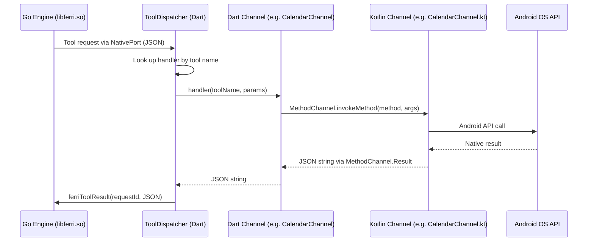
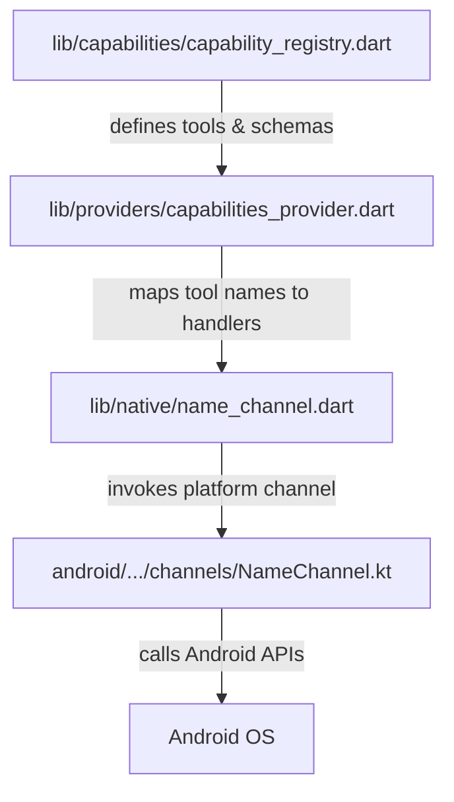

# Adding a New Capability to Ferri

## Overview

A **capability** in Ferri is a named group of tools that give the AI agent access to a specific phone feature -- calendar, contacts, location, clipboard, and so on. Each capability follows a consistent 4-layer pattern:

1. **Capability Registry (Dart)** -- declares the capability, its tools, and JSON schemas
2. **Kotlin Channel Handler (Android)** -- implements the native Android logic
3. **Dart Channel Wrapper** -- bridges tool calls from the engine to the platform channel
4. **Tool Dispatch Wiring** -- maps tool names to handler functions so the Go engine can invoke them

When the user enables a capability in the UI, Ferri requests the necessary permissions, registers the tool schemas with the Go engine, and starts routing tool calls through the full stack. This guide walks you through adding a new capability end-to-end.

For deeper context on how the engine, FFI bridge, and tool dispatch work together, see [ferri-architecture.md](../docs/ferri-architecture.md). For the full list of existing capabilities, see [ferri-capabilities.md](../docs/ferri-capabilities.md).

## Prerequisites

- You have read the [Architecture doc](../docs/ferri-architecture.md) and understand the Go engine / Dart FFI / platform channel flow.
- You have a working dev environment: Flutter 3.22+, Android SDK API 24+, NDK 28.2.13676358, Go 1.22+.
- You can build and run the app on a device or emulator.

## The Pattern

Every tool call follows the same round-trip through the stack:



The four files you touch for each layer:



## Step 1: Define Tools in the Capability Registry

**File:** `lib/capabilities/capability_registry.dart`

Every capability starts here. You declare a static `Capability` const with an ID, display metadata, permissions, and a list of `CapabilityTool` entries. Each tool has a name, description (sent to the LLM), and a JSON Schema for its parameters.

Add your new capability as a static const on the `CapabilityRegistry` class. Here is a trimmed example based on Calendar:

```dart
// In CapabilityRegistry class:

static const weather = Capability(
  id: 'weather',                              // Unique ID, used everywhere
  displayName: 'Weather',                     // Shown in the Capabilities UI
  description: 'Get current weather and forecasts',
  icon: Icons.cloud,                          // Material icon for the UI
  color: FerriColors.capWeather,              // Unique color (add to colors.dart)
  tier: CapabilityTier.core,                  // core or extended
  permissions: [                              // Android permissions to request at runtime
    'android.permission.ACCESS_FINE_LOCATION', // Only if your capability needs them
  ],
  tools: [
    CapabilityTool(
      name: 'weather_current',                // snake_case, domain-prefixed
      description:                            // This is what the LLM reads
          'Get current weather conditions for a location. '
          'Returns temperature, humidity, wind speed, and conditions.',
      schema: {                               // JSON Schema for parameters
        'type': 'object',
        'properties': {
          'location': {
            'type': 'string',
            'description': 'City name or "current" for device location',
          },
        },
        'required': ['location'],
      },
    ),
    CapabilityTool(
      name: 'weather_forecast',
      destructive: false,                     // Set true for write/delete operations
      description: 'Get weather forecast for the next N days.',
      schema: {
        'type': 'object',
        'properties': {
          'location': {
            'type': 'string',
            'description': 'City name or "current" for device location',
          },
          'days': {
            'type': 'integer',
            'description': 'Number of days to forecast (default 3)',
          },
        },
        'required': ['location'],
      },
    ),
  ],
);
```

Then add it to the `allCapabilities` list at the bottom of the class:

```dart
static const List<Capability> allCapabilities = [
  calendar,
  contacts,
  // ... existing entries ...
  weather,  // <-- your new capability
];
```

Key conventions to follow:

- **Tool names** use `snake_case` with a domain prefix: `weather_current`, not `getCurrentWeather`.
- **`destructive: true`** marks tools that modify data (create, update, delete). These trigger the user approval prompt before execution.
- **Schemas** follow JSON Schema. The `description` fields are critical -- they are the LLM's only guide to using the tool correctly.
- **`tier`** is either `CapabilityTier.core` (standard OS permissions) or `CapabilityTier.extended` (may need additional setup or privileged access).

### Add a capability color

In `lib/theme/colors.dart`, add a color constant for your capability:

```dart
static const capWeather = Color(0xFF42A5F5); // Pick a distinctive color
```

## Step 2: Create the Kotlin Channel Handler

**File:** `android/app/src/main/kotlin/com/ferri/ferri/channels/<Name>Channel.kt`

This is where the actual Android API interaction happens. Every channel handler implements `MethodChannel.MethodCallHandler` and routes method names to private functions.

Here is the pattern, annotated with the Calendar implementation as reference:

```kotlin
package com.ferri.ferri.channels

import android.content.Context
import io.flutter.plugin.common.MethodCall
import io.flutter.plugin.common.MethodChannel
import org.json.JSONObject

/**
 * Handles weather operations.
 * Registered as a MethodChannel handler in MainActivity.
 */
class WeatherChannel(private val context: Context) : MethodChannel.MethodCallHandler {

    companion object {
        // Channel name must match the Dart side exactly.
        // Convention: "ferri/<capability_id>"
        const val CHANNEL_NAME = "ferri/weather"
    }

    // Flutter calls this when Dart invokes a method on this channel.
    override fun onMethodCall(call: MethodCall, result: MethodChannel.Result) {
        when (call.method) {
            "getCurrent" -> getCurrent(call, result)
            "getForecast" -> getForecast(call, result)
            else -> result.notImplemented()
        }
    }

    private fun getCurrent(call: MethodCall, result: MethodChannel.Result) {
        try {
            // Extract arguments from the Dart side
            val location = call.argument<String>("location")
                ?: return result.error("INVALID_ARGS", "location is required", null)

            // ... interact with Android APIs or local data ...

            // Return a JSON string to Dart
            val response = JSONObject().apply {
                put("temperature", 22.5)
                put("humidity", 65)
                put("conditions", "partly_cloudy")
                put("location", location)
            }
            result.success(response.toString())

        } catch (e: SecurityException) {
            // Permission errors get their own error code
            result.error("PERMISSION_DENIED", "Permission not granted", e.message)
        } catch (e: Exception) {
            // Generic errors
            result.error("WEATHER_ERROR", "Failed to get weather", e.message)
        }
    }

    private fun getForecast(call: MethodCall, result: MethodChannel.Result) {
        // Same pattern: extract args, call APIs, return JSONObject.toString()
    }
}
```

Key points from the existing codebase:

- **Always return JSON strings** via `result.success(jsonObject.toString())`. The Dart side and ultimately the Go engine expect structured JSON.
- **Use `result.error(code, message, details)`** for errors. The Dart side catches these as `PlatformException`.
- **Channel name convention** is `ferri/<capability_id>` (e.g., `ferri/calendar`, `ferri/device_info`).
- **The `context` parameter** gives you access to Android APIs -- content resolvers, system services, and intents.

For a minimal example without complex Android APIs, look at how the Clipboard capability is implemented entirely in Dart (no Kotlin channel needed) in `lib/native/clipboard_channel.dart`. Not every capability needs native code.

## Step 3: Register in MainActivity

**File:** `android/app/src/main/kotlin/com/ferri/ferri/MainActivity.kt`

In `configureFlutterEngine`, add two lines that create the MethodChannel and attach your handler:

```kotlin
override fun configureFlutterEngine(flutterEngine: FlutterEngine) {
    super.configureFlutterEngine(flutterEngine)
    val messenger = flutterEngine.dartExecutor.binaryMessenger

    // ... existing channel registrations ...

    // Register your new channel
    MethodChannel(messenger, WeatherChannel.CHANNEL_NAME)
        .setMethodCallHandler(WeatherChannel(this))
}
```

The pattern is identical for every capability. Import your channel class at the top of the file:

```kotlin
import com.ferri.ferri.channels.WeatherChannel
```

## Step 4: Create the Dart Channel

**File:** `lib/native/<name>_channel.dart`

This Dart file bridges tool calls from the engine to the platform channel. Every Dart channel follows the same structure: a private constructor, a static `MethodChannel`, and a static `handleToolCall` method that switches on the tool name.

```dart
import 'dart:convert';
import 'package:flutter/foundation.dart';
import 'package:flutter/services.dart';

/// Dart wrapper around MethodChannel('ferri/weather').
/// Translates tool call params into MethodChannel invocations
/// and returns JSON string results.
class WeatherChannel {
  // Channel name must match the Kotlin CHANNEL_NAME exactly
  static const _channel = MethodChannel('ferri/weather');

  WeatherChannel._(); // Private constructor -- all methods are static

  /// Route a tool call to the appropriate MethodChannel method.
  /// Returns a JSON string result suitable for sending back to Go.
  static Future<String> handleToolCall(
      String toolName, Map<String, dynamic> params) async {
    debugPrint('[WeatherChannel] handleToolCall: $toolName');

    switch (toolName) {
      case 'weather_current':
        return _getCurrent(params);
      case 'weather_forecast':
        return _getForecast(params);
      default:
        throw PlatformException(
          code: 'UNKNOWN_TOOL',
          message: 'Unknown weather tool: $toolName',
        );
    }
  }

  static Future<String> _getCurrent(Map<String, dynamic> params) async {
    // Invoke the Kotlin method, passing only the params it needs.
    // Use conditional map entries for optional params.
    final result = await _channel.invokeMethod<String>('getCurrent', {
      'location': params['location'] as String,
    });
    return result ?? jsonEncode({'error': 'No result'});
  }

  static Future<String> _getForecast(Map<String, dynamic> params) async {
    final result = await _channel.invokeMethod<String>('getForecast', {
      'location': params['location'] as String,
      if (params['days'] != null) 'days': params['days'] as int,
    });
    return result ?? jsonEncode({'error': 'No result'});
  }
}
```

The critical contract: `handleToolCall` accepts `(String toolName, Map<String, dynamic> params)` and returns `Future<String>`. This matches the `ToolHandler` typedef in `lib/engine/tool_dispatcher.dart`:

```dart
typedef ToolHandler = Future<String> Function(
    String toolName, Map<String, dynamic> params);
```

## Step 5: Wire Tool Handlers in Capabilities Provider

**File:** `lib/providers/capabilities_provider.dart`

In the `_registerToolHandlers()` method of `CapabilitiesNotifier`, add an entry for each of your tools mapping the tool name to the Dart channel's `handleToolCall`:

```dart
void _registerToolHandlers() {
  // ... existing handler registrations ...

  // Weather tools -> WeatherChannel
  _engine.toolHandlers['weather_current'] = WeatherChannel.handleToolCall;
  _engine.toolHandlers['weather_forecast'] = WeatherChannel.handleToolCall;
}
```

Also add the import at the top of the file:

```dart
import '../native/weather_channel.dart';
```

Every tool from your capability gets its own entry in the handlers map. They all point to the same `handleToolCall` static method -- the switch inside that method routes to the right private implementation.

## Step 6: Add Permissions (if needed)

**File:** `android/app/src/main/AndroidManifest.xml`

If your capability requires Android permissions, declare them in the manifest. Follow the existing convention of commenting which capability each permission belongs to:

```xml
<!-- Weather capability -->
<uses-permission android:name="android.permission.ACCESS_FINE_LOCATION"/>
```

Permissions are requested at runtime when the user enables the capability. The `permissions` list in your `Capability` definition (Step 1) drives the runtime request via `PermissionManager.requestPermissions()`. Declaring them in the manifest is also required by Android.

For capabilities that need **privileged access** (like Notification Listener or Accessibility), set `privileged: true` and provide a `settingsRoute` in the Capability definition. These bypass runtime permission dialogs and instead open the system settings screen for the user to grant access manually.

## Step 7: Test

1. **Build and run** the app on a device or emulator.
2. **Open the Capabilities screen** and verify your new capability appears with the correct name, icon, and color.
3. **Enable it** -- confirm the permission request fires (if applicable) and the toggle switches to enabled.
4. **Test via chat** -- ask the agent to use your tool. For example: "What's the weather in Tokyo?"
5. **Verify the tool call card** renders in the chat UI showing the tool name, parameters, and result.
6. **Check logs** for the full round-trip:
   ```
   [ToolDispatcher] request: weather_current (req-xxx)
   [WeatherChannel] handleToolCall: weather_current
   [ToolDispatcher] resolved: req-xxx
   ```
7. **Disable the capability** and confirm the tools are no longer available to the agent.

## Full Example: Calendar Reference Implementation

The Calendar capability touches every layer. Here is the complete file list with what each one does:

| Layer | File | What it does |
|-------|------|-------------|
| Registry | `lib/capabilities/capability_registry.dart` | Defines `calendar` with 4 tools: `calendar_read_events`, `calendar_create_event`, `calendar_update_event`, `calendar_delete_event`. Each has a JSON Schema with required/optional params. |
| Model | `lib/capabilities/models/capability.dart` | Defines `Capability`, `CapabilityTool`, `CapabilityTier`, and `CapabilityStatus` -- the data structures used by the registry. |
| Colors | `lib/theme/colors.dart` | `capCalendar = Color(0xFF4F86F7)` -- the blue color for Calendar in the UI. |
| Kotlin | `android/.../channels/CalendarChannel.kt` | Implements `MethodCallHandler` with methods `readEvents`, `createEvent`, `updateEvent`, `deleteEvent`. Uses `CalendarContract` content provider to query/insert/update/delete events. Returns JSON strings. |
| MainActivity | `android/.../MainActivity.kt` | `MethodChannel(messenger, CalendarChannel.CHANNEL_NAME).setMethodCallHandler(CalendarChannel(this))` |
| Dart Channel | `lib/native/calendar_channel.dart` | Routes `calendar_*` tool names to `_readEvents`, `_createEvent`, etc. Each invokes the corresponding MethodChannel method and returns the JSON result. |
| Wiring | `lib/providers/capabilities_provider.dart` | Maps all 4 tool names to `CalendarChannel.handleToolCall`. |
| Manifest | `android/app/src/main/AndroidManifest.xml` | Declares `READ_CALENDAR` and `WRITE_CALENDAR` permissions. |
| Features | `docs/ferri_features_list.md` | Tracks Calendar as implemented on Android, not yet on iOS. |

## Checklist

Use this checklist before submitting your PR:

- [ ] **Capability Registry** -- new `Capability` const added with correct `id`, `displayName`, `icon`, `color`, `tier`, `permissions`, and `tools`
- [ ] **Capability added to `allCapabilities` list** at the bottom of `CapabilityRegistry`
- [ ] **Color added** to `lib/theme/colors.dart` with a `cap<Name>` constant
- [ ] **Kotlin channel handler** created at `android/.../channels/<Name>Channel.kt` implementing `MethodCallHandler`
- [ ] **`CHANNEL_NAME`** follows the `ferri/<id>` convention
- [ ] **Kotlin returns JSON strings** via `JSONObject.toString()` through `result.success()`
- [ ] **Error handling** uses `result.error()` with descriptive codes for permission and argument errors
- [ ] **Channel registered in `MainActivity.kt`** in `configureFlutterEngine`
- [ ] **Dart channel** created at `lib/native/<name>_channel.dart` with static `handleToolCall`
- [ ] **Tool handlers wired** in `capabilities_provider.dart` `_registerToolHandlers()` -- one entry per tool name
- [ ] **Import added** in `capabilities_provider.dart` for the new Dart channel
- [ ] **Android permissions declared** in `AndroidManifest.xml` (if needed)
- [ ] **Permissions listed** in the `Capability.permissions` array match the manifest declarations
- [ ] **Tool names** are `snake_case` with domain prefix (e.g., `weather_current`)
- [ ] **Destructive tools** have `destructive: true` in the `CapabilityTool` definition
- [ ] **Feature tracking updated** in `docs/ferri_features_list.md`
- [ ] **Tested end-to-end** -- capability appears in UI, enables cleanly, agent can call tools, tool cards render in chat
- [ ] **No personal paths, IPs, or internal references** in committed code
