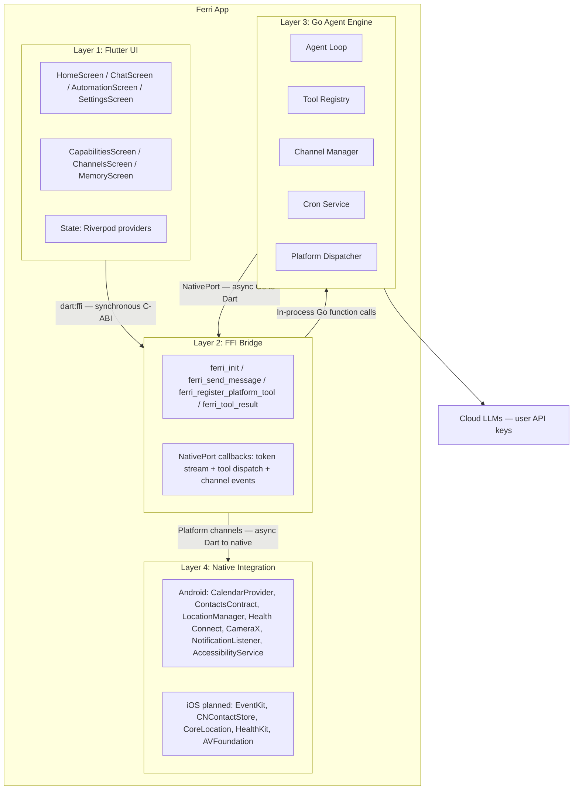
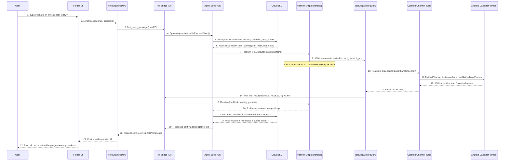

# Architecture

Ferri is a mobile-native AI agent app built on Flutter and Go. It takes a Go-based agent engine, compiles it as a C-ABI shared library (`libferri.so`), loads it into a Flutter app via `dart:ffi`, and registers phone OS capabilities -- calendar, contacts, location, health data, sensors, and more -- as callable tools in the agent loop. The result is an LLM that can read and act on your actual life data, entirely on your device except for the LLM API call itself.

---

## 1. System Overview

The app is organized into four layers. Each layer communicates with its neighbors through a well-defined boundary: FFI for Dart-to-Go, NativePort for Go-to-Dart, and platform channels for Dart-to-native OS APIs.



---

## 2. Layer 1: Flutter UI

The UI is a standard Flutter application using Riverpod for state management. It runs a 4-tab navigation shell defined in `lib/screens/main_shell.dart`:

- **Home** -- Dashboard with status and quick actions.
- **Chat** -- Conversational interface with the agent. Messages stream in token-by-token. Tool call cards appear inline, showing exactly what the agent accessed and how long it took.
- **Automate** -- Cron jobs, geofence triggers, and heartbeat configuration.
- **Settings** -- LLM provider selection, API key management, capability toggles, channel configuration, memory editing, and skills management.

Additional screens include Capabilities (per-capability permission management), Channels (Telegram/Discord/Slack bot status), and Memory (view/edit the engine's persistent workspace files).

**State management.** All mutable state lives in Riverpod providers under `lib/providers/`. Key providers:

- `engineProvider` -- Manages the `FerriEngine` instance lifecycle.
- `chatProvider` -- Chat message history, streaming state, tool event display.
- `capabilitiesProvider` -- Per-capability enabled/disabled state, tool registration.
- `settingsProvider` -- LLM provider, model, API key, background service toggle.
- `automationProvider` -- Cron job list, heartbeat status.
- `channelsProvider` -- Telegram/Discord/Slack connection state.

**Theme.** Terracotta primary (`#E8553A`), dark background (`#0D0E1A`), card surfaces (`#14162A`). Fonts: DM Serif Display for display text, DM Sans for body, JetBrains Mono for code. Colors are centralized in `lib/theme/colors.dart`.

**Tool call visualization.** Every time the agent reads a calendar, checks a location, or queries health data, a tool call card appears in the chat -- before the final response. Each card shows the tool name, parameters, result preview, and execution duration. This is a non-negotiable design principle: users see what the agent accessed.

---

## 3. Layer 2: FFI Bridge

The bridge is the critical boundary between Dart and Go. It uses `dart:ffi` to load the compiled Go shared library and call exported C-ABI functions synchronously. Asynchronous data flows back from Go to Dart via Dart's NativePort mechanism.

**Loading the library.** On Android, `DynamicLibrary.open('libferri.so')` loads the NDK-compiled shared library from `android/app/src/main/jniLibs/`. On iOS (planned), the engine will be statically linked, accessed via `DynamicLibrary.process()`. Dart-side binding setup lives in `lib/engine/ferri_bindings.dart`.

**Synchronous C-ABI exports** (`engine/mobile/bridge.go`) cross the FFI boundary for commands:

| Export | Purpose |
|--------|---------|
| `ferri_init` | Initialize the engine with provider config JSON |
| `ferri_send_message` | Submit a user message; agent loop runs asynchronously in a Go goroutine |
| `ferri_register_platform_tool` | Register a tool schema so the LLM can call it |
| `ferri_unregister_platform_tool` | Remove a tool when the user revokes a capability |
| `ferri_tool_result` | Return a platform tool result from Dart back to Go |
| `ferri_stop` | Shut down the engine, cancel in-flight operations |
| `ferri_enable_channel` / `ferri_disable_channel` | Start or stop a messaging channel (Telegram, Discord, Slack) |
| `ferri_cron_*` | Create, delete, toggle, and list cron jobs |
| `ferri_heartbeat_*` | Enable/disable heartbeat, set interval and prompt |
| `ferri_list_skills` / `ferri_install_skill` / `ferri_uninstall_skill` | Manage agent skills |
| `ferri_get_history` / `ferri_clear_session` | Session history management |
| `ferri_free_string` | Free Go-allocated C strings from Dart |

**NativePort callbacks** handle asynchronous Go-to-Dart communication via three ports:

1. **Token stream port** -- Go sends each LLM response token (or tool event) as a JSON string. Dart's `TokenStream` (`lib/engine/token_stream.dart`) receives it and forwards to the chat UI.
2. **Tool dispatch port** -- Go sends a tool call request (tool name, parameters, request ID). Dart's `ToolDispatcher` (`lib/engine/tool_dispatcher.dart`) routes it to the appropriate channel handler, executes it, and calls `ferri_tool_result` to unblock the waiting Go goroutine.
3. **Channel event port** -- Go sends channel-related events (incoming Telegram messages, connection status changes). Dart's `ChannelEventStream` (`lib/engine/channel_event_stream.dart`) forwards them to the channels provider.

---

## 4. Layer 3: Go Agent Engine

The engine runs in-process as a shared library. It contains all reasoning logic, tool definitions, memory management, scheduling, and channel management. The mobile bridge (`engine/mobile/bridge.go`) adapts the engine's internal API to C-ABI exports.

**Agent loop** (`engine/core/agent/`). The core reasoning cycle:

1. Receive a user message.
2. Assemble the prompt: system instructions + memory context + conversation history + tool definitions.
3. Send to the configured LLM provider.
4. If the LLM responds with tool calls, execute each tool via the tool registry.
5. Feed tool results back to the LLM.
6. Repeat steps 3-5 until the LLM produces a final text response (or a max iteration limit is hit).
7. Stream the final response back to Dart via the token port.

The agent loop runs in a Go goroutine, so `ferri_send_message` returns immediately to the Dart caller.

**Tool registry** (`engine/core/tools/`). Tools are registered dynamically. The engine starts with a small set of built-in Go tools (web search, web fetch, filesystem operations within the workspace). Platform tools -- calendar, contacts, location, and others -- are registered at runtime from Dart when the user grants permissions. Each tool provides a name, description, and JSON Schema for the LLM.

**Platform dispatcher** (`engine/platform/`). The `Dispatcher` bridges the gap between Go's synchronous goroutine model and Dart's async execution. When a `PlatformTool` executes, the dispatcher serializes the request as JSON (with a UUID), posts it to Dart via NativePort, and blocks the goroutine on a Go channel. When Dart calls `ferri_tool_result`, the dispatcher resolves the pending channel and unblocks the goroutine. A 30-second timeout prevents goroutine leaks.

**Multi-provider LLM support** (`engine/core/providers/`). The engine supports 8 provider backends: OpenRouter, Anthropic, OpenAI, Groq, DeepSeek, SambaNova, Gemini, and Custom (any OpenAI-compatible endpoint). Provider selection and API keys are configured from the Flutter settings screen and passed to Go via the init config JSON.

**Channels** (`engine/core/channels/`). A channel manager handles persistent messaging integrations: Telegram, Discord, and Slack. Channels are enabled/disabled at runtime via FFI. Inbound messages from these channels are processed through the same agent loop, and responses are dispatched back through the channel.

**Cron scheduler** (`engine/core/cron/`). A cron service runs recurring agent tasks with 1-second tick resolution. Jobs are persisted to `cron_store.json` in the workspace. Supports time-based schedules and geofence triggers.

**Heartbeat** (`engine/core/heartbeat/`). A periodic check-in system where the engine runs a user-defined prompt at a configurable interval (default 30 minutes). The prompt is stored as `HEARTBEAT.md` in the workspace.

**Memory** (`engine/core/agent/memory.go`). The engine maintains a workspace directory in the app's sandboxed storage. The LLM can read and write files in this directory -- notes, context, preferences -- giving it persistent memory across conversations.

**Skills** (`engine/core/skills/`). Installable prompt-based extensions from GitHub repositories. The skills loader discovers and injects skill prompts into the agent's system context.

---

## 5. Layer 4: Native Integration

Native phone APIs are accessed through Flutter platform channels. Each capability maps to one Kotlin channel handler (Android) and one Dart channel wrapper.

**The pattern for every capability:**

1. **Kotlin channel handler** in `android/app/src/main/kotlin/.../channels/` -- implements `MethodChannel` and calls Android SDK APIs.
2. **Dart channel wrapper** in `lib/native/` -- receives tool call parameters from the `ToolDispatcher`, invokes the Kotlin handler via `MethodChannel('ferri/<capability>')`, and returns the JSON result.
3. **Capability definition** in `lib/capabilities/capability_registry.dart` -- declares the capability's tools, their schemas, required permissions, display metadata, and tier.

Channel naming convention: `ferri/<capability>` (e.g., `ferri/calendar`, `ferri/contacts`, `ferri/location`).

**Dynamic tool set.** Tools are only registered with the engine when the user grants the corresponding permission. If the user disables a capability, its tools are unregistered and the LLM can no longer call them. This is handled by `lib/providers/capabilities_provider.dart`.

**Approval gate.** Destructive tools (those that create, modify, or delete data) can require explicit user approval before execution. The `ToolDispatcher` checks whether a tool is marked destructive and, if approval is enabled, shows a confirmation dialog before proceeding. If the user denies, the tool call is rejected and the agent is informed.

**Current Android capabilities** (28 domains): Calendar, Contacts, Location, Camera, Health, SMS, Call Log, Notifications, Notification Listener, Bluetooth, Device Info, Clipboard, Alarms, Reminders, App Launcher, Phone Dial, Email, Maps, Sharing, Audio, WiFi, Sensors, Files, NFC, Geofence, Usage Stats, Voice, and Accessibility.

For details on each capability's tools and permissions, see [CAPABILITIES.md](CAPABILITIES.md).

---

## 6. Data Flow: A Complete Tool Call

Tracing "What's on my calendar today?" through the full system, step by step:



The tool dispatch round-trip (steps 8-15) typically takes 5-50ms. The dominant latency is the LLM API call (steps 5-6 and 17-18), which takes 1-5 seconds depending on the provider and model.

---

## 7. Key Design Decisions

**Why Go, not pure Dart or Kotlin?** The agent engine is a complex system: an agent loop with multi-turn tool execution, a cron scheduler, a channel manager for Telegram/Discord/Slack, a memory system, and multi-provider LLM support. This engine already existed as a Go codebase. Rewriting it in Dart would have been months of work for no user-visible benefit. Go compiles to a shared library via cgo, making it straightforward to embed in a mobile app.

**Why FFI, not method channels for the engine?** Method channels are asynchronous and involve serialization overhead on every call. FFI gives synchronous, zero-copy function calls for commands like `ferri_send_message` and `ferri_register_platform_tool`. The engine runs in the same process as the Flutter app -- there is no IPC boundary, just a function call.

**Why NativePort, not synchronous FFI returns?** The agent loop is asynchronous -- it calls an LLM, waits for a response, potentially executes multiple tool calls, then generates a final answer. This can take seconds. Blocking the Dart UI thread would freeze the app. NativePort lets Go post messages (tokens, tool requests, channel events) to Dart asynchronously without blocking either side.

**Why platform channels for native APIs, not FFI?** Android APIs (`CalendarProvider`, `ContactsContract`, etc.) must be called on the main thread or require Android `Context`. Platform channels handle this naturally -- they dispatch to Kotlin code running on the platform thread with full access to the Android SDK. FFI cannot access these APIs.

**Why a platform dispatcher with blocking channels?** The Go agent loop is synchronous within a goroutine: call tool, get result, continue. But the actual tool execution happens asynchronously in Dart/Kotlin. The `Dispatcher` (`engine/platform/dispatcher.go`) bridges this gap: it sends a request to Dart via NativePort, then blocks the goroutine on a Go channel until Dart calls `ferri_tool_result()` with the response. This gives Go synchronous semantics while the actual work happens asynchronously. The 30-second timeout prevents goroutine leaks if Dart never responds.

---

## 8. Directory Structure

```
ferri/
├── engine/                          # Go agent engine
│   ├── mobile/
│   │   └── bridge.go                # C-ABI exports (FFI boundary)
│   ├── platform/
│   │   ├── dispatcher.go            # Synchronous tool dispatch to Dart
│   │   ├── tool.go                  # PlatformTool implementation
│   │   └── types.go                 # PlatformRequest / PlatformResponse
│   └── core/
│       ├── agent/                   # Agent loop, memory, context builder
│       │   ├── loop.go              # Main agent reasoning loop
│       │   ├── mobile.go            # Mobile-specific agent constructor
│       │   ├── memory.go            # Workspace memory system
│       │   └── context.go           # Prompt assembly
│       ├── tools/                   # Built-in tool implementations
│       │   ├── registry.go          # Tool name to handler map
│       │   ├── web.go               # Web search, web fetch
│       │   ├── filesystem.go        # File read/write within workspace
│       │   ├── cron.go              # Cron management tool
│       │   └── shell.go             # Shell execution (desktop only)
│       ├── providers/               # LLM provider backends
│       │   ├── factory.go           # Provider creation from config
│       │   ├── http_provider.go     # OpenAI-compatible HTTP provider
│       │   └── anthropic/           # Anthropic native provider
│       ├── channels/                # Messaging integrations
│       │   ├── manager.go           # Channel lifecycle management
│       │   ├── telegram.go          # Telegram bot adapter
│       │   ├── discord.go           # Discord bot adapter
│       │   └── slack.go             # Slack bot adapter
│       ├── cron/
│       │   └── service.go           # Cron scheduler with 1s tick resolution
│       ├── heartbeat/
│       │   └── service.go           # Periodic agent check-in
│       ├── skills/
│       │   ├── loader.go            # Skill discovery and injection
│       │   └── installer.go         # GitHub-based skill installation
│       ├── config/
│       │   └── config.go            # Configuration types and defaults
│       ├── bus/
│       │   └── bus.go               # Inbound/outbound message bus
│       └── session/
│           └── manager.go           # Conversation session persistence
├── lib/                             # Flutter / Dart
│   ├── engine/
│   │   ├── ferri_engine.dart        # High-level engine API
│   │   ├── ferri_bindings.dart      # dart:ffi binding definitions
│   │   ├── token_stream.dart        # NativePort listener for LLM tokens
│   │   ├── tool_dispatcher.dart     # NativePort listener for tool requests
│   │   └── channel_event_stream.dart # NativePort listener for channel events
│   ├── native/                      # Platform channel wrappers per capability
│   │   ├── calendar_channel.dart
│   │   ├── contacts_channel.dart
│   │   ├── location_channel.dart
│   │   ├── health_channel.dart
│   │   ├── camera_channel.dart
│   │   ├── sms_channel.dart
│   │   └── ...                      # 28+ additional channel files
│   ├── capabilities/
│   │   ├── capability_registry.dart # All capability and tool definitions
│   │   ├── models/capability.dart   # Capability data model
│   │   └── permission_manager.dart  # Runtime permission handling
│   ├── providers/                   # Riverpod state providers
│   │   ├── engine_provider.dart
│   │   ├── chat_provider.dart
│   │   ├── capabilities_provider.dart
│   │   ├── settings_provider.dart
│   │   ├── automation_provider.dart
│   │   └── channels_provider.dart
│   ├── screens/                     # UI screens
│   │   ├── main_shell.dart          # Tab navigation shell
│   │   ├── home/
│   │   ├── chat/
│   │   │   ├── chat_screen.dart
│   │   │   └── widgets/             # message_bubble, tool_call_card, etc.
│   │   ├── automation/
│   │   ├── settings/
│   │   ├── capabilities/
│   │   ├── channels/
│   │   └── onboarding/
│   ├── theme/
│   │   └── colors.dart              # Brand color constants
│   └── widgets/                     # Shared widgets
└── android/
    └── app/src/main/kotlin/.../
        ├── MainActivity.kt          # Channel registration
        └── channels/                # Kotlin MethodChannel handlers
            ├── CalendarChannel.kt
            ├── ContactsChannel.kt
            └── ...
```

---

## See Also

- [CAPABILITIES.md](CAPABILITIES.md) -- Full reference for all native capabilities, tools, and permissions
- [ADDING_A_CAPABILITY.md](ADDING_A_CAPABILITY.md) -- Step-by-step guide to adding a new native capability
