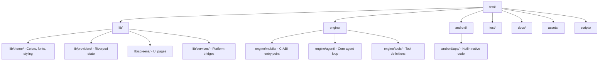

# Contributing to Ferri

Thank you for your interest in Ferri. Whether you are fixing a bug, adding a phone capability, improving documentation, or building a new feature, your contribution makes a difference.

This guide walks you through everything you need to go from zero to an open pull request.

## Code of Conduct

All participants are expected to be respectful, constructive, and assume good intent.

## What We Need Help With

- **New phone capabilities** -- exposing Android/iOS native APIs as agent tools (this is the most impactful contribution)
- **Go engine improvements** -- performance, new LLM provider support, tool dispatch
- **Flutter UI** -- chat experience, settings, capability management screens
- **Testing** -- unit tests, integration tests, device testing
- **Documentation** -- guides, capability references, architecture docs
- **Bug fixes** -- see open issues labeled `good first issue` or `bug`

## Getting Started

### Prerequisites

| Tool | Version |
|------|---------|
| Flutter | 3.22+ |
| Dart SDK | >=3.3.0 <4.0.0 |
| Go | 1.22+ |
| Android SDK | API 26+ |
| Android NDK | 28.x |
| JDK | 17+ |

### Setup

1. **Fork and clone the repo**

   ```bash
   git clone https://github.com/<your-username>/ferri.git
   cd ferri
   ```

2. **Install Flutter dependencies**

   ```bash
   flutter pub get
   ```

3. **Set your NDK path**

   The Makefile reads `NDK_HOME` (or `ANDROID_NDK_HOME`). Export it before building:

   ```bash
   export NDK_HOME=$ANDROID_HOME/ndk/<your-ndk-version>
   ```

4. **Build the Go engine**

   For a physical ARM64 device:
   ```bash
   make build-engine-android-arm64
   ```

   For an x86_64 emulator:
   ```bash
   make build-engine-android-x86
   ```

   For both architectures:
   ```bash
   make build-engine-android-all
   ```

5. **Run the app**

   ```bash
   make run-android       # physical device (builds arm64 engine first)
   make run-android-emu   # emulator (builds x86 engine first)
   ```

   Or, if the engine is already built:
   ```bash
   flutter run
   ```

## Development Workflow

1. **Create a branch** from `main`:

   ```bash
   git checkout -b feat/calendar-write-events
   ```

2. **Make your changes.** Keep commits focused and atomic.

3. **Run tests and lint** before pushing:

   ```bash
   make test    # runs both Go engine tests and Flutter tests
   make lint    # runs go vet + flutter analyze
   ```

4. **Push and open a PR** against `main`.

## Code Style

### Dart

- Linting is enforced via `analysis_options.yaml`, which extends `package:flutter_lints/flutter.yaml`. Run `flutter analyze` and fix all issues before submitting.
- Use **Riverpod** for state management.
- Platform channel names follow the pattern `ferri/<capability>` (e.g., `ferri/calendar`, `ferri/contacts`).
- Tool names use `snake_case` with a domain prefix: `calendar_read_events`, `contacts_search`.
- Tool results must be structured JSON.

### Kotlin

- Follow standard Android Kotlin conventions.
- Channel handlers implement the `MethodCallHandler` pattern.
- Keep each capability's native implementation in its own file.

### Go

- Format with `gofmt`. Vet with `go vet ./...`.
- The engine is in `engine/` and compiles to a C-shared library (`libferri.so`). Changes here affect the core agent loop.
- **Engine changes require explicit maintainer review.** Flag them clearly in your PR description.

## Commit Conventions

We use [Conventional Commits](https://www.conventionalcommits.org/):

```
<type>: <short description>
```

| Type | Use when... |
|------|-------------|
| `feat` | Adding a new feature or capability |
| `fix` | Fixing a bug |
| `refactor` | Restructuring code without changing behavior |
| `docs` | Documentation only |
| `test` | Adding or updating tests |
| `chore` | Build system, CI, dependencies, tooling |

**Examples:**

```
feat: add calendar write events capability
fix: handle null response from contacts API
refactor: extract tool dispatch into separate module
docs: update capabilities reference with health tools
test: add unit tests for location provider
chore: bump Go dependencies
```

## Testing

### Go Engine

```bash
make test-engine
# equivalent to: cd engine && go test ./...
```

### Flutter / Dart

```bash
make test-dart
# equivalent to: flutter test
```

### Full Suite

```bash
make test
```

### Lint

```bash
make lint
# runs: go vet ./... + flutter analyze
```

### Device Testing

For changes that touch platform channels or native APIs, manual testing on a real device or emulator is expected. Include a brief description of what you tested in your PR.

To run on an emulator:
```bash
make run-android-emu
```

To clean and rebuild:
```bash
make clean
make build-engine-android-arm64
flutter run
```

## Pull Request Process

1. **All PRs target `main`.**
2. **CI must pass.** Tests and lint are required.
3. **Engine changes** (`engine/` directory) require maintainer sign-off. Call this out in your PR title or description.
4. **PRs that add or modify capabilities** must update [docs/ferri_features_list.md](../docs/ferri_features_list.md) -- this is the source of truth for what is implemented on each platform.
5. **PRs that add new tools** should update [docs/ferri-capabilities.md](../docs/ferri-capabilities.md) with the tool schema and description.
6. Keep PRs focused. One capability or fix per PR is ideal.
7. Write a clear PR description: what changed, why, and how to test it.

## Adding a Capability

Adding a new phone capability (e.g., reading SMS, accessing fitness data) is the most common and most impactful type of contribution. The workflow spans all three layers of the stack:

1. **Kotlin** -- implement the native Android method channel handler
2. **Dart** -- create the platform channel bridge and register the capability
3. **Go** -- define the tool schema so the agent knows how to call it

See [docs/ferri-capabilities.md](../docs/ferri-capabilities.md) for the full reference of existing capabilities and the patterns they follow. When in doubt, look at an existing capability like `calendar` or `contacts` as a template.

After adding a capability, update:
- [docs/ferri_features_list.md](../docs/ferri_features_list.md) (implementation status)
- [docs/ferri-capabilities.md](../docs/ferri-capabilities.md) (tool reference)

## Project Structure



## Reporting Bugs

Open an issue using the **Bug Report** template. Include:

- **Device info**: model, Android/iOS version, SDK level
- **Steps to reproduce**: clear, numbered steps
- **Expected vs. actual behavior**
- **Logs**: use `adb logcat` to capture relevant output (filter with `-s ferri:*` for engine logs, `-s flutter:*` for Flutter logs)
- **Screenshots or screen recordings** if applicable

## Feature Requests

Open an issue using the **Feature Request** template. Describe:

- The problem you are trying to solve
- Your proposed solution
- Which phone capabilities it would need
- Whether you are willing to implement it

## Documentation

- [docs/ferri_features_list.md](../docs/ferri_features_list.md) -- cross-platform feature tracking (source of truth)
- [docs/ferri-capabilities.md](../docs/ferri-capabilities.md) -- native capabilities and tool reference
- [docs/ferri-architecture.md](../docs/ferri-architecture.md) -- system architecture deep-dive

Update these docs as part of your PR when applicable. Documentation-only PRs are welcome.

## License

Ferri uses a **dual license** structure:

| Directory | License |
|-----------|---------|
| `engine/` | MIT License |
| Everything else | Apache License 2.0 |

The Go engine is derived from [PicoClaw](https://github.com/sipeed/picoclaw) and retains the MIT License for compatibility. See [NOTICE](../NOTICE) for full attribution details.

By submitting a pull request, you agree that your contributions will be licensed under the applicable license for the files you modify.

---

Questions? Open a [Discussion](https://github.com/ferri-ai/ferri/discussions) or reach out in an existing issue thread. We are happy to help you get started.
