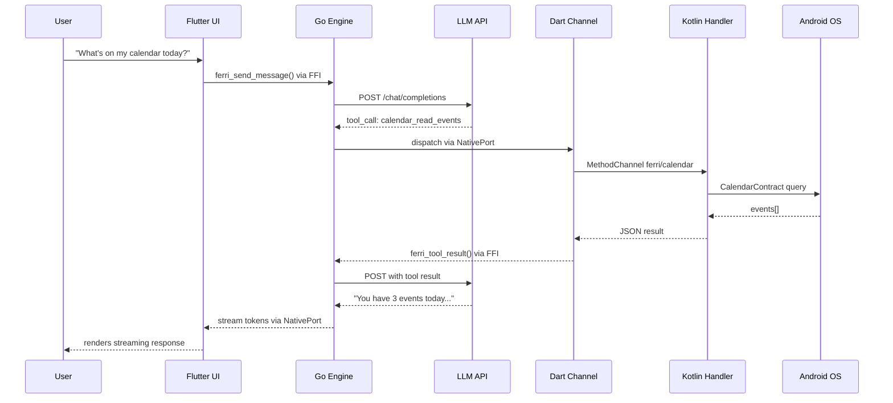

# Architecture Overview

Ferri is a mobile-native AI agent app built on Flutter and Go. It takes a Go-based agent engine, compiles it as a shared library (`libferri.so`), loads it into a Flutter app via `dart:ffi`, and exposes phone OS capabilities -- calendar, contacts, location, health data, sensors, and more -- as callable tools in the agent loop. The result is an LLM that can read and act on your actual life data, entirely on your device except for the LLM API call itself.

Ferri's Go agent engine is derived from PicoClaw, an open-source Go-based AI agent framework. Throughout this document, it is referred to as "the engine" or "Ferri's engine."

---

## The Stack

```
+------------------------------------------------------------------+
|                          FERRI APP                                |
|                                                                   |
|  +------------------------------------------------------------+  |
|  |                    LAYER 1: FLUTTER UI                      |  |
|  |                                                             |  |
|  |  HomeScreen   ChatScreen   AutomationScreen   SettingsScreen|  |
|  |  CapabilitiesScreen   ChannelsScreen   MemoryScreen         |  |
|  |                                                             |  |
|  |  State: Riverpod providers                                  |  |
|  |  Theme: Terracotta #E8553A, dark bg #0D0E1A, card #14162A  |  |
|  +-------------------------+----------------------------------+  |
|                            | dart:ffi (synchronous C-ABI)        |
|  +-------------------------v----------------------------------+  |
|  |                    LAYER 2: FFI BRIDGE                      |  |
|  |                                                             |  |
|  |  ferri_init()               ferri_send_message()            |  |
|  |  ferri_register_platform_tool()  ferri_tool_result()        |  |
|  |  ferri_set_token_port()     ferri_set_tool_dispatch_port()  |  |
|  |  ferri_cron_*()             ferri_heartbeat_*()             |  |
|  |                                                             |  |
|  |  NativePort callbacks: token stream + tool dispatch +       |  |
|  |                        channel events                       |  |
|  +-------------------------+----------------------------------+  |
|                            | In-process Go function calls        |
|  +-------------------------v----------------------------------+  |
|  |                    LAYER 3: GO AGENT ENGINE                 |  |
|  |                                                             |  |
|  |  +----------+  +-------------+  +----------+  +----------+ |  |
|  |  | Agent    |  | Tool        |  | Channel  |  | Cron     | |  |
|  |  | Loop     |  | Registry    |  | Manager  |  | Service  | |  |
|  |  +----+-----+  +------+------+  +----+-----+  +----+-----+ |  |
|  |       |               |              |              |       |  |
|  |  +----v---------------v--------------v--------------v----+  |  |
|  |  |           Platform Dispatcher                          |  |  |
|  |  |  Go -> NativePort -> Dart -> platform channel -> OS    |  |  |
|  |  +-------------------------------------------------------+  |  |
|  +-------------------------+----------------------------------+  |
|                            | Platform channels (async)           |
|  +-------------------------v----------------------------------+  |
|  |                    LAYER 4: NATIVE INTEGRATION              |  |
|  |                                                             |  |
|  |  Android (Kotlin):           iOS (Swift, planned):          |  |
|  |  CalendarProvider            EventKit                       |  |
|  |  ContactsContract            CNContactStore                 |  |
|  |  FusedLocationProvider       CoreLocation                   |  |
|  |  Health Connect              HealthKit                      |  |
|  |  CameraX                     AVFoundation                   |  |
|  |  NotificationListener        UNUserNotificationCenter       |  |
|  |  AccessibilityService        --                             |  |
|  |  TelephonyManager (SMS)      Messages (compose only)        |  |
|  +------------------------------------------------------------+  |
|                            |                                     |
|                   +--------v--------+                            |
|                   |   Cloud LLMs    |                            |
|                   | (user API keys) |                            |
|                   +-----------------+                            |
+------------------------------------------------------------------+
```

---

## Layer 1: Flutter UI

The UI is a standard Flutter application using Riverpod for state management. It runs a 4-tab navigation shell defined in `lib/screens/main_shell.dart`:

- **Home** -- Dashboard with status and quick actions.
- **Chat** -- Conversational interface with the agent. Messages stream in token-by-token. Tool call cards appear inline, showing exactly what the agent accessed and how long it took.
- **Automate** -- Cron jobs, geofence triggers, and heartbeat configuration.
- **Settings** -- LLM provider selection, API key management, capability toggles, channel configuration, and memory editing.

Additional screens accessible from navigation or settings include Capabilities (per-capability permission management), Channels (Telegram/Discord/Slack bot status), and Memory (view/edit the engine's persistent workspace files).

**State management.** All mutable state lives in Riverpod providers under `lib/providers/`. Key providers:

- `engineProvider` -- Manages the `FerriEngine` instance lifecycle.
- `chatProvider` -- Chat message history, streaming state, tool event display.
- `capabilitiesProvider` -- Per-capability enabled/disabled state, tool registration.
- `settingsProvider` -- LLM provider, model, API key, background service toggle.
- `automationProvider` -- Cron job list, heartbeat status.
- `channelsProvider` -- Telegram/Discord/Slack connection state.

**Theme.** Terracotta primary (`#E8553A`), dark background (`#0D0E1A`), card surfaces (`#14162A`). Fonts: DM Serif Display for display text, DM Sans for body, JetBrains Mono for code. Colors are centralized in `lib/theme/colors.dart`.

**Custom widgets.** Tool call cards render each tool invocation with the tool name, parameters, result preview, and duration. Streaming message bubbles render LLM output as it arrives via the token stream.

---

## Layer 2: FFI Bridge

The bridge is the critical boundary between Dart and Go. It uses `dart:ffi` to load the compiled Go shared library and call exported C-ABI functions synchronously. Asynchronous data flows back from Go to Dart via Dart's NativePort mechanism.

**Loading the library.** On Android, `DynamicLibrary.open('libferri.so')` loads the NDK-compiled shared library. On iOS (planned), the engine will be statically linked, accessed via `DynamicLibrary.process()`. The Dart-side binding setup lives in `lib/engine/ferri_bindings.dart`.

**Synchronous C-ABI functions** cross the FFI boundary for commands:

- `ferri_init` -- Initialize the engine with provider config JSON.
- `ferri_send_message` -- Submit a user message; the agent loop runs asynchronously in a Go goroutine.
- `ferri_register_platform_tool` -- Register a tool schema so the LLM can call it.
- `ferri_tool_result` -- Return a platform tool result from Dart back to Go.
- `ferri_stop` -- Shut down the engine, cancel in-flight operations.
- Cron and heartbeat management functions (`ferri_cron_create`, `ferri_cron_delete`, `ferri_heartbeat_set_enabled`, etc.).

**NativePort callbacks** handle asynchronous Go-to-Dart communication via three ports:

1. **Token stream port** -- Go sends each LLM response (or tool event) as a JSON string. Dart's `TokenStream` (`lib/engine/token_stream.dart`) receives it and forwards to the chat UI.
2. **Tool dispatch port** -- Go sends a tool call request (tool name, parameters, request ID). Dart's `ToolDispatcher` (`lib/engine/tool_dispatcher.dart`) routes it to the appropriate channel handler, executes it, and calls `ferri_tool_result` to unblock the waiting Go goroutine.
3. **Channel event port** -- Go sends channel-related events (incoming Telegram messages, connection status changes). Dart's `ChannelEventStream` (`lib/engine/channel_event_stream.dart`) forwards them to the channels provider.

The bridge source is `engine/mobile/bridge.go` on the Go side and the `lib/engine/` directory on the Dart side.

---

## Layer 3: Go Agent Engine

The engine runs in-process as a shared library. It contains all reasoning logic, tool definitions, memory management, scheduling, and channel management. The mobile bridge (`engine/mobile/bridge.go`) adapts the engine's API to C-ABI exports.

**Agent loop.** The core reasoning cycle:

1. Receive a user message.
2. Assemble the prompt: system instructions + memory context + conversation history + tool definitions.
3. Send to the configured LLM provider.
4. If the LLM responds with tool calls, execute each tool via the tool registry.
5. Feed tool results back to the LLM.
6. Repeat steps 3-5 until the LLM produces a final text response (or a max iteration limit is hit).
7. Stream the final response back to Dart via the token port.

The agent loop runs in a Go goroutine, so `ferri_send_message` returns immediately to the Dart caller.

**Tool registry.** Tools are registered dynamically. The engine starts with a small set of built-in Go tools (web search, web fetch, filesystem operations within the workspace). Platform tools -- calendar, contacts, location, etc. -- are registered at runtime from Dart when the user grants permissions. Currently 79+ platform tools are defined across 28+ capability domains in `lib/capabilities/capability_registry.dart`. Each tool provides a name, description, and JSON Schema for the LLM.

**Multi-provider LLM support.** The engine supports 8 provider backends: OpenRouter, Anthropic, OpenAI, Groq, DeepSeek, SambaNova, Gemini, and Custom (any OpenAI-compatible endpoint). Provider selection and API keys are configured from the Flutter settings screen and passed to Go via the init config JSON.

**Channels.** The engine includes a channel manager for persistent messaging integrations: Telegram, Discord, and Slack. Channels are enabled/disabled at runtime via FFI. Inbound messages from these channels are processed through the same agent loop, and responses are dispatched back through the channel.

**Cron scheduler.** A cron service (`engine/core/cron/`) runs recurring agent tasks with 1-second tick resolution. Jobs are persisted to `cron_store.json` in the workspace. Supports time-based schedules and geofence triggers.

**Heartbeat.** A periodic check-in system where the engine runs a user-defined prompt at a configurable interval (default 30 minutes). The prompt is stored as `HEARTBEAT.md` in the workspace.

**Memory.** The engine maintains a workspace directory in the app's sandboxed storage. The LLM can read and write files in this directory -- notes, context, preferences -- giving it persistent memory across conversations.

---

## Layer 4: Native Integration

Native phone APIs are accessed through Flutter platform channels. Each capability maps to one Kotlin channel handler (Android) and one Dart channel wrapper.

**The pattern for every capability:**

1. **Kotlin channel handler** in `android/app/src/main/kotlin/com/ferri/ferri/channels/` -- e.g., `CalendarChannel.kt`. Implements `MethodChannel` and calls Android SDK APIs (`CalendarContract`, `ContactsContract`, `FusedLocationProviderClient`, etc.).
2. **Dart channel wrapper** in `lib/native/` -- e.g., `calendar_channel.dart`. Receives tool call parameters from the `ToolDispatcher`, invokes the Kotlin handler via `MethodChannel('ferri/calendar')`, and returns the JSON result.
3. **Capability definition** in `lib/capabilities/capability_registry.dart` -- declares the capability's tools, their schemas, required permissions, display metadata, and tier.

Channel naming convention: `ferri/<capability>` (e.g., `ferri/calendar`, `ferri/contacts`, `ferri/location`).

**Dynamic tool set.** Tools are only registered with the engine when the user grants the corresponding permission. If the user disables a capability, its tools are unregistered and the LLM can no longer call them. This is handled by `lib/providers/capabilities_provider.dart`.

**Current Android capabilities** (28+ domains, 79+ tools): Calendar, Contacts, Location, Camera, Health, SMS, Call Log, Notifications, Notification Listener, Bluetooth, Device Info, Clipboard, Alarms, Reminders, App Launcher, Phone Dial, Email, Maps, Sharing, Audio, WiFi, Sensors, Files, NFC, Geofence, Usage Stats, Voice, and Accessibility.

---

## Data Flow: A Complete Tool Call

Tracing "What's on my calendar today?" through the system:

1. **User types message** in the Chat screen.
2. **Flutter** calls `FerriEngine.sendMessage()` which converts the string to a C string and calls `ferri_send_message()` via FFI.
3. **Go bridge** receives the call, spawns a goroutine, and calls `AgentLoop.ProcessDirect()`.
4. **Agent loop** assembles the prompt with the message, conversation history, and definitions for all registered tools (including `calendar_read_events`).
5. **LLM API call** -- the engine sends the prompt to the configured provider (e.g., OpenRouter, Anthropic).
6. **LLM responds** with a tool call: `calendar_read_events({"start_date": "2026-02-23T00:00:00", "end_date": "2026-02-24T00:00:00"})`.
7. **Tool registry** looks up `calendar_read_events` -- it is a platform tool, so `PlatformTool.Execute()` is called.
8. **Platform dispatcher** (`engine/platform/dispatcher.go`) serializes the request as JSON (with a unique request ID), sends it to Dart via the tool dispatch NativePort, and blocks on a channel waiting for the result.
9. **Dart `ToolDispatcher`** (`lib/engine/tool_dispatcher.dart`) receives the request, looks up the handler, and calls `CalendarChannel.handleToolCall()`.
10. **Dart `CalendarChannel`** (`lib/native/calendar_channel.dart`) invokes `MethodChannel('ferri/calendar').invokeMethod('readEvents', ...)`.
11. **Kotlin `CalendarChannel`** (`android/.../channels/CalendarChannel.kt`) queries `CalendarContract` via Android's ContentProvider and returns JSON.
12. **Result returns** up the stack: Kotlin -> Dart platform channel -> Dart `ToolDispatcher` calls `ferri_tool_result()` via FFI -> Go `Dispatcher.Resolve()` unblocks the waiting goroutine.
13. **Agent loop** feeds the calendar data back to the LLM as a tool result.
14. **LLM generates** a natural language response summarizing the calendar events.
15. **Go sends** the response as a token message via the token stream NativePort.
16. **Dart `TokenStream`** receives the message, forwards it to the chat provider, and the UI renders the response.

The tool dispatch round-trip (steps 8-12) typically takes 5-50ms. The dominant latency is the LLM API call (steps 5-6 and 13-14).



---

## Key Design Decisions

**Why Go, not pure Dart or Kotlin?** The agent engine is a complex system: an agent loop with multi-turn tool execution, a cron scheduler, a channel manager for Telegram/Discord/Slack, a memory system, and multi-provider LLM support. This engine already existed as a Go codebase. Rewriting it in Dart would have been months of work for no user-visible benefit. Go compiles to a shared library via cgo, making it straightforward to embed in a mobile app.

**Why FFI, not method channels for the engine?** Method channels are asynchronous and involve serialization overhead on every call. FFI gives synchronous, zero-copy function calls for commands like `ferri_send_message` and `ferri_register_platform_tool`. The engine runs in the same process as the Flutter app -- there is no IPC boundary, just a function call.

**Why NativePort, not synchronous FFI returns?** The agent loop is asynchronous -- it calls an LLM, waits for a response, potentially executes multiple tool calls, then generates a final answer. This can take seconds. Blocking the Dart UI thread would freeze the app. NativePort lets Go post messages (tokens, tool requests, channel events) to Dart asynchronously without blocking either side.

**Why platform channels for native APIs, not FFI?** Android APIs (CalendarProvider, ContactsContract, etc.) must be called on the main thread or require Android `Context`. Platform channels handle this naturally -- they dispatch to Kotlin code running on the platform thread with full access to the Android SDK. FFI cannot access these APIs.

**Why a platform dispatcher with blocking channels?** The Go agent loop is synchronous within a goroutine: call tool, get result, continue. But the actual tool execution happens asynchronously in Dart/Kotlin. The `Dispatcher` (`engine/platform/dispatcher.go`) bridges this gap: it sends a request to Dart via NativePort, then blocks the goroutine on a Go channel until Dart calls `ferri_tool_result()` with the response. This gives Go synchronous semantics while the actual work happens asynchronously. The 30-second timeout prevents goroutine leaks if Dart never responds.
