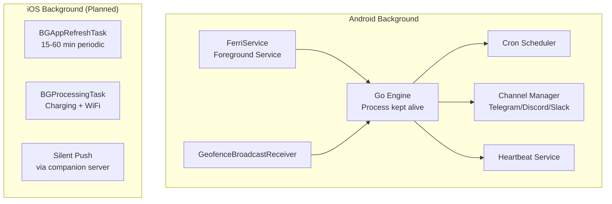

# Background Execution

Ferri's agent capabilities -- channels, cron jobs, geofence monitoring -- require the app to stay alive in the background. This page documents how Ferri achieves persistent background execution on Android and the planned approach for iOS.

---

## Architecture

## Android: Foreground Service (Tested)

Android aggressively kills background processes to conserve battery. Ferri uses an Android Foreground Service to prevent this.

### FerriService

`FerriService.kt` is a persistent Android service that keeps the Ferri process alive. When running, it displays a low-priority notification in the status bar.

**What it does:**
- Holds a foreground service lock, preventing Android from killing the app process.
- Keeps the Go engine running so it can maintain channel connections, fire cron jobs, and process geofence triggers.
- Displays a notification showing the current state: number of active channels and scheduled jobs.
- Uses `START_STICKY` -- if the system kills the service, Android will restart it.

**What it does not do:**
- It does not perform any work itself. It simply keeps the process alive. The Go engine handles all actual background work.
- It does not wake the CPU. The Go engine is idle between agent calls.

### Enabling the Service

1. Go to **Settings > Background Service**.
2. Toggle it on.
3. A persistent notification appears: "Ferri -- Running in background" (or showing active channel/job counts).

### When Is the Service Needed?

The foreground service is required for:

- **Channels:** Telegram, Discord, and Slack bots need persistent connections. Without the service, Android kills the process and the connections drop.
- **Cron jobs:** The Go engine's cron scheduler must be running to fire jobs on schedule. Without the service, scheduled jobs will not execute when the app is in the background.
- **Geofence processing:** While Android's GMS GeofencingClient monitors location independently, the `GeofenceBroadcastReceiver` needs to reach the Go engine via Dart FFI to process the trigger. The service ensures the engine is available.

If you are not using channels, cron jobs, or geofences, you do not need the foreground service.

### Disabling the Service

Toggle the Background Service off in Settings. If no channels are active, the service stops cleanly and the notification disappears. If channels are still enabled when you disable the service, their connections will be lost.

---

## Geofence Background Monitoring (Tested)

Geofence location monitoring operates through a separate mechanism from the foreground service.

- **Google Play Services GeofencingClient** monitors the device's location independently of Ferri's process state. The OS handles location checks using its own optimized pipeline (cell towers, WiFi, GPS as needed).
- When the device enters, exits, or dwells in a registered geofence area, Android delivers the transition event to `GeofenceBroadcastReceiver`.
- The receiver extracts the fence ID and transition type (enter, exit, dwell), then calls `GeofenceChannel.triggerGeofence()`.
- This triggers `ferri_trigger_geofence` via Dart FFI, which sends the associated prompt through the agent loop.
- The full pipeline requires the Go engine to be running, which is why the foreground service must be enabled for geofence automations to work end-to-end.

Geofence registration survives app restarts -- GMS maintains the fences at the OS level. However, processing the triggers requires the Ferri service to be running.

---

## iOS: Background Tasks (Coming Soon)

iOS does not allow third-party apps to run persistent background processes. This is a fundamental platform constraint that Ferri will be transparent about rather than try to work around with unreliable hacks.

### Planned Approach

**BGAppRefreshTask:**
- iOS grants periodic 30-second windows for background refresh, at the OS's discretion.
- Ferri will use these windows for lightweight heartbeat checks.
- Timing is not guaranteed -- iOS decides when and how often to grant refresh windows based on app usage patterns.

**BGProcessingTask:**
- Up to 30 minutes of background execution, but only while charging and on WiFi.
- Suitable for longer agent tasks but not for persistent channel connections.

**Silent Push Notifications:**
- An optional companion server could send silent pushes to wake the app for processing.
- This is the only viable path for near-real-time channel responsiveness on iOS.
- Would require Ferri to run a push notification relay server, which conflicts with the current no-server architecture. Under evaluation.

**Live Activities:**
- iOS Live Activities provide a visible presence on the Lock Screen.
- Could be used to show agent status or recent automation results.
- Does not solve the background execution problem but improves visibility.

### Reality

Persistent channel listeners (Telegram, Discord, Slack bots) will not work on iOS without either a companion server or the app being in the foreground. Cron jobs will be best-effort, firing during OS-granted refresh windows rather than at exact times. Geofences can work through iOS's built-in location monitoring, similar to GMS on Android.

Ferri will clearly communicate these limitations in the iOS UI rather than pretending background execution works the same as Android.

---

## Battery Considerations

Ferri's background execution is designed to minimize battery impact.

- **Foreground service overhead is minimal.** The Go engine is idle between agent calls. It consumes negligible CPU when no messages are arriving and no jobs are firing. The persistent notification uses `IMPORTANCE_LOW` to avoid vibration or sound.
- **Location monitoring is efficient.** Geofences use Google Play Services' optimized location APIs, not continuous GPS polling. GMS batches location checks and uses cell tower and WiFi signals when possible.
- **No polling loops.** Channel connections use WebSocket or long-polling at the protocol level, which are idle-efficient. The app does not wake the CPU on a timer to check for messages.
- **User control.** The foreground service can be disabled at any time in Settings. Users who do not need channels or automations can turn it off entirely, eliminating all background battery usage.
