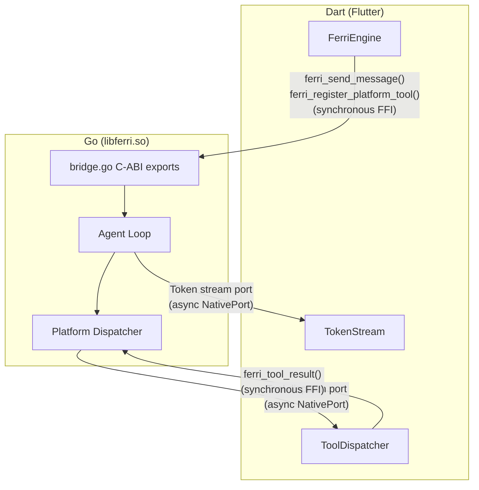

# FFI Bridge and NativePort

How Flutter talks to Go, and how Go talks back.

---

## Overview

Ferri's Go agent engine runs as an in-process shared library, not as a separate service. The communication boundary between Dart and Go is a C-ABI interface exposed via `dart:ffi`. This is deliberately not a platform channel -- platform channels are designed for Dart-to-native-platform communication (Kotlin/Swift) and add serialization overhead. FFI gives synchronous, zero-copy function calls within the same process.

The challenge is that Go's agent loop is inherently asynchronous: it calls an LLM, waits for responses, executes tool calls, and streams tokens. Dart cannot block on these operations without freezing the UI. The solution is a split design:

- **Dart-to-Go**: synchronous FFI calls for commands (`ferri_send_message`, `ferri_register_platform_tool`).
- **Go-to-Dart**: asynchronous NativePort callbacks for events (tokens, tool dispatch requests, channel events).



---

## C-ABI Exports (bridge.go)

The Go side of the bridge is `engine/mobile/bridge.go`. It uses cgo to export functions with C calling conventions. Each exported function is marked with `//export` and uses C types for parameters and return values.

### Core Functions

- **`ferri_init(configJSON *C.char) C.int`** -- Initialize the engine with a JSON config containing provider name, model, API key, API base URL, and workspace path. Creates the agent loop, platform dispatcher, cron service, and heartbeat service. Returns 0 on success, negative on error.
- **`ferri_init_dart_api(postCObject unsafe.Pointer)`** -- Register Dart's `NativeApi.postCObject` function pointer so Go can post messages to NativePort. Must be called before setting any ports.
- **`ferri_send_message(message *C.char, sessionID *C.char) C.int`** -- Send a user message to the agent loop. The agent loop runs asynchronously in a Go goroutine. Returns 0 immediately.
- **`ferri_stop()`** -- Stop the engine. Cancels all in-flight LLM operations, stops cron/heartbeat services, stops channel manager, and cleans up goroutines.

### NativePort Setup

- **`ferri_set_token_port(port C.int64_t)`** -- Register the NativePort for token streaming (LLM responses, tool events, errors).
- **`ferri_set_tool_dispatch_port(port C.int64_t)`** -- Register the NativePort for tool dispatch requests (Go asking Dart to execute a platform tool).
- **`ferri_set_channel_event_port(port C.int64_t)`** -- Register the NativePort for channel events (incoming messages from Telegram/Discord/Slack, connection status changes).

### Platform Tool Functions

- **`ferri_register_platform_tool(name *C.char, desc *C.char, schema *C.char) C.int`** -- Register a tool schema with the engine. The LLM will see this tool in its available tool set. When the LLM calls it, the request is dispatched to Dart via the tool dispatch port.
- **`ferri_unregister_platform_tool(name *C.char) C.int`** -- Remove a tool from the engine. The LLM will no longer see it.
- **`ferri_tool_result(requestID *C.char, resultJSON *C.char)`** -- Deliver a platform tool result from Dart back to Go. This unblocks the goroutine that dispatched the tool call.

### Cron Functions

- **`ferri_cron_list() *C.char`** -- List all cron jobs as JSON.
- **`ferri_cron_create(jobJSON *C.char) *C.char`** -- Create a cron job from a JSON spec.
- **`ferri_cron_delete(jobID *C.char) *C.char`** -- Delete a cron job by ID.
- **`ferri_cron_toggle(jobID *C.char, enabled C.int) *C.char`** -- Enable or disable a cron job.
- **`ferri_trigger_geofence(jobID *C.char) *C.char`** -- Manually trigger a geofence-bound job.

### Heartbeat Functions

- **`ferri_heartbeat_set_enabled(enabled C.int) *C.char`** -- Enable or disable the heartbeat loop.
- **`ferri_heartbeat_set_interval(minutes C.int) *C.char`** -- Set the heartbeat interval in minutes.
- **`ferri_heartbeat_get_status() *C.char`** -- Get heartbeat running state and interval.
- **`ferri_heartbeat_get_prompt() *C.char`** -- Read the heartbeat prompt from `HEARTBEAT.md`.
- **`ferri_heartbeat_set_prompt(markdown *C.char) *C.char`** -- Write a new heartbeat prompt.

### Channel Management Functions

- **`ferri_enable_channel(name *C.char, configJSON *C.char) C.int`** -- Enable a messaging channel (telegram, discord, slack) with the provided config JSON containing credentials. Returns 0 on success.
- **`ferri_disable_channel(name *C.char) C.int`** -- Disable a messaging channel. Returns 0 on success.
- **`ferri_get_channel_status() *C.char`** -- Get status of all channels as a JSON map. Caller must free with `ferri_free_string`.

### Skills Functions

- **`ferri_list_skills() *C.char`** -- List all installed skills as JSON. Caller must free with `ferri_free_string`.
- **`ferri_install_skill(repo *C.char) *C.char`** -- Install a skill from a GitHub repo (e.g. "user/skill-name"). Returns result JSON. Caller must free with `ferri_free_string`.
- **`ferri_uninstall_skill(name *C.char) *C.char`** -- Uninstall a skill by name. Returns result JSON. Caller must free with `ferri_free_string`.

### Utility Functions

- **`ferri_get_history(sessionKey *C.char) *C.char`** -- Get conversation history for a session as JSON. Caller must free with `ferri_free_string`.
- **`ferri_clear_session(sessionKey *C.char) *C.char`** -- Clear a session's history and summary. Returns result JSON. Caller must free with `ferri_free_string`.
- **`ferri_free_string(s *C.char)`** -- Free a C string allocated by Go. Dart must call this for any string returned by Go to avoid memory leaks.

---

## NativePort Callbacks

Go sends data to Dart by posting C strings to NativePort. The bridge stores three port numbers and a function pointer to Dart's `Dart_PostCObject`.

### Token Stream Port

Used for LLM responses and tool events. Go sends JSON messages with this structure:

```json
{"type": "token", "content": "Here are your calendar events...", "session_id": "default"}
{"type": "done", "content": "", "session_id": "default"}
{"type": "error", "content": "API key invalid", "session_id": "default"}
{"type": "tool_event", "content": "{\"type\":\"tool_start\",\"tool_name\":\"calendar_read_events\",...}"}
```

The `type` field is one of: `token` (LLM response text), `done` (agent loop finished), `error` (something failed), or `tool_event` (a tool started or completed execution).

### Tool Dispatch Port

Used for platform tool call requests. When the LLM calls a platform tool, Go serializes the request and posts it to this port:

```json
{"request_id": "uuid-here", "tool_name": "calendar_read_events", "params": {"start_date": "2026-02-23T00:00:00", "end_date": "2026-02-24T00:00:00"}}
```

The Go goroutine then blocks on a channel, waiting for `ferri_tool_result` to be called with the same `request_id`.

### Channel Event Port

Used for messaging channel events. Three event types:

```json
{"type": "channel_status", "channel": "telegram", "status": "connected"}
{"type": "channel_message", "channel": "telegram", "sender": "user123", "chat_id": "456", "content": "hello"}
{"type": "channel_response", "channel": "telegram", "chat_id": "456", "content": "Response text..."}
```

---

## The Dart Side

The Dart engine layer lives in `lib/engine/` and consists of five files:

- **`ferri_bindings.dart`** -- `DynamicLibrary` loader and FFI function signature typedefs. Opens `libferri.so` on Android or `DynamicLibrary.process()` on iOS. Looks up all exported C functions by name.
- **`ferri_engine.dart`** -- High-level `FerriEngine` class that orchestrates initialization: creates bindings, sets up NativePort listeners, calls `ferri_init`, and provides methods for `sendMessage`, `registerPlatformTool`, cron/heartbeat operations.
- **`token_stream.dart`** -- Opens a `ReceivePort`, exposes its `nativePort` integer, listens for incoming JSON strings, deserializes them into `TokenMessage` objects, and calls the registered callback.
- **`tool_dispatcher.dart`** -- Opens a `ReceivePort` for tool dispatch. Maintains a map of tool name to handler function. When a request arrives, looks up the handler, executes it asynchronously, then calls `ferri_tool_result` via FFI to unblock Go. Supports an approval gate for destructive tools.
- **`channel_event_stream.dart`** -- Opens a `ReceivePort` for channel events. Deserializes incoming JSON into `ChannelEvent` objects and forwards to the registered callback.

Library loading (from `ferri_bindings.dart`):

```dart
_lib = Platform.isAndroid
    ? DynamicLibrary.open('libferri.so')
    : DynamicLibrary.process(); // iOS: statically linked (future)
```

---

## Memory Management

Strings cross the FFI boundary as C strings (`Pointer<Utf8>`). The rules:

**Dart-to-Go.** Dart converts a Dart string to a native UTF-8 pointer using `.toNativeUtf8()`, calls the FFI function, then frees the pointer with `calloc.free()`. Go receives a `*C.char`, converts it to a Go string with `C.GoString()` (which copies the data), and the Go string is managed by the Go garbage collector.

**Go-to-Dart (return values).** Go allocates a C string with `C.CString()` and returns it. Dart reads the pointer with `.toDartString()` (which copies the data into a Dart string), then calls `ferri_free_string()` to free the C-allocated memory. Failing to call `ferri_free_string` leaks memory.

**Go-to-Dart (NativePort).** Go allocates a C string with `C.CString()`, posts it via `post_string()` / `post_tool_request()` / `post_channel_event()`, then frees it with `C.free()`. The NativePort infrastructure copies the data into the Dart heap, so Go can free immediately after posting.

---

## Debugging the Bridge

**Go-side logging.** All Go `logf()` calls write to Android's logcat via `__android_log_write` with the tag `ferri`. Filter with:

```bash
adb logcat -s ferri:* *:S
```

**Dart-side logging.** Flutter `debugPrint` calls appear under the `flutter` logcat tag. Each engine component prefixes its logs: `[FerriEngine]`, `[TokenStream]`, `[ToolDispatcher]`, `[ChannelEventStream]`.

**Common FFI errors:**

- **Symbol not found** -- The Go function name in `DynamicLibrary.lookupFunction` does not match the `//export` name in `bridge.go`. Check for typos and ensure the library was rebuilt after adding new exports.
- **Wrong architecture** -- `libferri.so` was compiled for arm64 but running on x86 emulator (or vice versa). Use `make build-engine-android-arm64` for physical devices and `make build-engine-android-x86` for emulators.
- **Segfault from freed pointer** -- Dart freed a `Pointer<Utf8>` before Go finished reading it, or Go freed a `C.CString` before Dart copied it. Ensure the ownership rules above are followed.
- **Timeout on tool dispatch** -- The `Dispatcher` in Go has a 30-second timeout. If Dart takes longer than 30 seconds to respond to a tool call, the goroutine returns a timeout error and the pending request is cleaned up.
