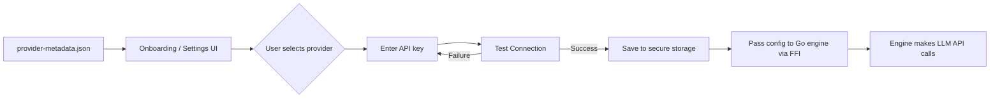

# LLM Providers

Ferri uses a **BYOK (Bring Your Own Key)** model. There is no Ferri server. Users provide their own API keys for the LLM provider of their choice, and all inference calls go directly from the phone to the provider's API.

---

## BYOK Model

Ferri never stores or proxies API keys on a remote server -- there is no remote server. The architecture is direct: your phone talks to the LLM provider, and nothing else sits in between.

- **Local-only key storage.** API keys are stored in Android Keystore (iOS Keychain support is planned). They never leave the device except as part of the outbound API request to the provider you selected.
- **No telemetry, no analytics server.** The only network traffic Ferri generates is the LLM API call itself, sent to the base URL of your chosen provider.
- **Switch providers at any time.** Settings > LLM Configuration lets you change provider, API key, and model. Changes take effect immediately without restarting the app.
- **You control costs.** Because you use your own API key, billing is between you and the provider. Ferri has no subscription, no usage fees, and no middleman markup.

---

## Supported Providers

All providers listed below have been tested with Ferri.

| Provider | Models | Base URL | Notes |
|----------|--------|----------|-------|
| **OpenRouter** | 300+ (Claude, GPT, Llama, Gemini, DeepSeek, Qwen, free models) | `openrouter.ai/api/v1` | Recommended for beginners. Single API key gives access to hundreds of models across providers, including several free-tier options. |
| **Anthropic** | Claude Sonnet 4.5, Claude Haiku 4.5 | `api.anthropic.com/v1` | Direct access to Anthropic's Claude models. |
| **OpenAI** | GPT-4o, GPT-4o Mini, GPT-4.1, GPT-4.1 Mini | `api.openai.com/v1` | OpenAI's GPT family. |
| **Groq** | Llama 3.3 70B, GPT-OSS 120B, Qwen QwQ 32B, Llama 3.1 8B | `api.groq.com/openai/v1` | Fastest inference speeds. Good for quick, responsive interactions. |
| **DeepSeek** | DeepSeek V3.2, DeepSeek R1 (Reasoner) | `api.deepseek.com/v1` | Cost-effective. R1 offers chain-of-thought reasoning. |
| **SambaNova** | Llama 3.3 70B, DeepSeek V3.1, Llama 4 Maverick | `api.sambanova.ai/v1` | Enterprise-grade inference for open-source models. |
| **Gemini** | Gemini 2.5 Flash, Gemini 2.5 Flash Lite, Gemini 2.5 Pro | `generativelanguage.googleapis.com/v1beta` | Google's Gemini models. |
| **Custom** | Any OpenAI-compatible model | User-defined URL | For self-hosted setups (Ollama, llama.cpp, vLLM, text-generation-webui). |

---

## How Provider Selection Works

Provider configuration is metadata-driven. The flow:

1. **`assets/provider-metadata.json`** defines every provider: display name, tagline, key URL (where to get an API key), expected key prefix, base URL, recommended model, and available model list.
2. During onboarding (or later in Settings), the user sees a list of providers with logos and taglines.
3. The user selects a provider, enters their API key, and optionally picks a specific model from the provider's model list. Each provider has a recommended default.
4. **"Test Connection"** validates the key by making a real API call to the provider. If the call succeeds, the configuration is saved. If it fails, the user sees the error.
5. The validated configuration is stored in secure storage on the device.
6. When Ferri's Go engine starts (or restarts), it receives the provider config -- base URL, API key, model ID -- via FFI. The engine uses this to make all subsequent LLM calls.

---

## Custom Endpoint

The Custom provider option exists for users who run their own models locally or on private infrastructure.

**Use cases:**
- Ollama running on a desktop machine on the same WiFi network
- llama.cpp server on a home lab
- vLLM or text-generation-webui on a GPU server
- Any OpenAI-compatible API endpoint

**Configuration:**
- **Base URL:** The full URL to your server (e.g., `http://192.168.1.100:11434/v1` for Ollama)
- **API key:** Optional. Leave blank if your server does not require authentication.
- **Model name:** The model identifier your server expects (e.g., `llama3.2` for Ollama)

**Requirements:**
- The endpoint must be OpenAI-compatible: it must accept `POST /chat/completions` with the standard request format and return the standard response format.
- The device must be able to reach the server over the network (same LAN, VPN, or public URL).

---

## Changing Providers

To change your provider, API key, or model after initial setup:

1. Open **Settings** (gear icon).
2. Tap **LLM Configuration**.
3. Select a new provider, enter a new API key, or pick a different model.
4. Tap **Test Connection** to validate.
5. Save. The change takes effect immediately -- no app restart required. The Go engine picks up the new configuration on the next agent call.

You can change providers as often as you want. There is no lock-in. Your conversation history is preserved across provider changes; only the model generating new responses changes.
