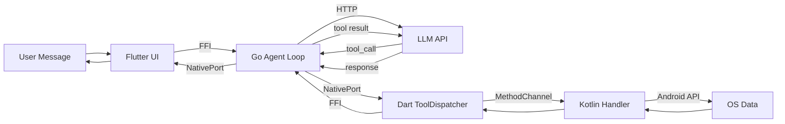

# Tool Dispatch Pipeline

End-to-end flow of a single tool call, from user message to rendered response. This document traces what happens when a user asks "What's on my calendar today?" and the agent calls the `calendar_read_events` tool.

---

## Visual Overview



---

## The Pipeline

### Step 1: User sends a message

The user types "What's on my calendar today?" in the Chat screen. The chat provider calls `FerriEngine.sendMessage()`.

**File:** `lib/engine/ferri_engine.dart`

```dart
void sendMessage(String message, {String sessionId = 'default'}) {
    final msgPtr = message.toNativeUtf8();
    final sidPtr = sessionId.toNativeUtf8();
    _bindings.ferriSendMessage(msgPtr, sidPtr);
    calloc.free(msgPtr);
    calloc.free(sidPtr);
}
```

### Step 2: FFI call into Go

`ferri_send_message` in the bridge receives the C strings, converts them to Go strings, and spawns a goroutine to run the agent loop. The FFI call returns immediately to Dart.

**File:** `engine/mobile/bridge.go`

The goroutine calls `agentLoop.ProcessDirect(ctx, msg, sid)` with a 90-second timeout context.

### Step 3: Agent loop assembles the prompt

The agent loop builds a prompt containing:
- System instructions and memory context (files from the workspace directory).
- Conversation history for the session.
- Tool definitions for all registered tools -- both built-in Go tools and platform tools registered via `ferri_register_platform_tool`.

The prompt is sent to the configured LLM provider.

**File:** `engine/core/agent/` (agent loop internals)

### Step 4: LLM responds with a tool call

The LLM decides it needs calendar data and responds with a tool call:

```
tool_call: calendar_read_events({"start_date": "2026-02-23T00:00:00", "end_date": "2026-02-24T00:00:00"})
```

### Step 5: Tool registry lookup

The agent loop looks up `calendar_read_events` in the tool registry. This tool was registered as a `PlatformTool` (not a built-in Go tool), so `PlatformTool.Execute()` is called.

**File:** `engine/platform/tool.go`

```go
func (t *PlatformTool) Execute(ctx context.Context, args map[string]interface{}) *tools.ToolResult {
    t.sendNotification("tool_start", args, "", 0)
    start := time.Now()
    data, err := t.dispatcher.Dispatch(ctx, t.name, args)
    elapsed := time.Since(start)
    // ...
}
```

The `PlatformTool` sends a `tool_start` notification to the UI via the token port, then delegates to the `Dispatcher`.

### Step 6: Dispatcher sends request to Dart

The `Dispatcher` creates a unique request ID, serializes the request as JSON, posts it to the tool dispatch NativePort, and blocks on a Go channel waiting for the result.

**File:** `engine/platform/dispatcher.go`

```go
func (d *Dispatcher) Dispatch(ctx context.Context, toolName string, params map[string]interface{}) (string, error) {
    requestID := uuid.New().String()
    resultCh := make(chan PlatformResponse, 1)
    d.pending.Store(requestID, resultCh)
    defer d.pending.Delete(requestID)

    req := PlatformRequest{RequestID: requestID, ToolName: toolName, Params: params}
    reqJSON, _ := json.Marshal(req)
    d.postFunc(string(reqJSON))

    select {
    case resp := <-resultCh:
        // ...
    case <-time.After(d.timeout):
        // 30-second timeout
    }
}
```

The JSON posted to the NativePort looks like:

```json
{
    "request_id": "a1b2c3d4-...",
    "tool_name": "calendar_read_events",
    "params": {
        "start_date": "2026-02-23T00:00:00",
        "end_date": "2026-02-24T00:00:00"
    }
}
```

### Step 7: Dart ToolDispatcher receives the request

The `ToolDispatcher` listens on its `ReceivePort`. When the JSON arrives, it deserializes it into a `ToolRequest` and looks up the handler.

**File:** `lib/engine/tool_dispatcher.dart`

If the tool is marked as destructive and approval is required, the dispatcher invokes the `onApprovalRequired` callback and waits for user confirmation before proceeding.

### Step 8: Dart routes to the calendar channel

The handler for `calendar_read_events` was registered during capability initialization by `CapabilitiesNotifier._registerToolHandlers()`. It points to `CalendarChannel.handleToolCall`.

**File:** `lib/providers/capabilities_provider.dart`

```dart
_engine.toolHandlers['calendar_read_events'] = CalendarChannel.handleToolCall;
```

### Step 9: CalendarChannel invokes the platform channel

`CalendarChannel.handleToolCall` switches on the tool name and calls the appropriate method on the `MethodChannel('ferri/calendar')`.

**File:** `lib/native/calendar_channel.dart`

```dart
static Future<String> _readEvents(Map<String, dynamic> params) async {
    final result = await _channel.invokeMethod<String>('readEvents', {
        'start_date': params['start_date'] as String,
        'end_date': params['end_date'] as String,
    });
    return result ?? '[]';
}
```

### Step 10: Kotlin handler queries Android APIs

The platform channel dispatches to `CalendarChannel.kt`, which queries Android's `CalendarContract` content provider. The Kotlin code runs on the platform thread with full access to the Android SDK and `Context`.

**File:** `android/app/src/main/kotlin/com/ferri/ferri/channels/CalendarChannel.kt`

The Kotlin handler returns a JSON string containing the calendar events.

### Step 11: Result returns through Dart

The `MethodChannel.invokeMethod` future completes with the JSON string from Kotlin. Control returns to `CalendarChannel.handleToolCall`, then to the `ToolDispatcher._handleRequest` method.

### Step 12: Dart sends result back to Go

The `ToolDispatcher` wraps the result in a `PlatformResponse` JSON envelope and calls `ferri_tool_result` via FFI.

**File:** `lib/engine/tool_dispatcher.dart`

```dart
final requestIdPtr = request.requestId.toNativeUtf8();
final resultPtr = responseJson.toNativeUtf8();
_bindings.ferriToolResult(requestIdPtr, resultPtr);
calloc.free(requestIdPtr);
calloc.free(resultPtr);
```

### Step 13: Go dispatcher unblocks

`ferri_tool_result` in `bridge.go` calls `platformDispatcher.Resolve(requestID, resultJSON)`. The `Resolve` method finds the pending channel by request ID and sends the response, unblocking the goroutine that was waiting in `Dispatch`.

**File:** `engine/platform/dispatcher.go`

```go
func (d *Dispatcher) Resolve(requestID string, responseJSON string) error {
    val, ok := d.pending.Load(requestID)
    ch := val.(chan PlatformResponse)
    ch <- resp
    return nil
}
```

### Step 14: Agent loop feeds result to LLM

The `PlatformTool.Execute` method receives the result data, sends a `tool_end` notification to the UI (with the duration), and returns the result to the agent loop. The agent loop feeds the calendar data back to the LLM as a tool result.

### Step 15: LLM generates a response

The LLM processes the calendar data and produces a natural language summary. The agent loop receives the response.

### Step 16: Response streams to Flutter UI

The agent loop sends the response as a `TokenMessage` via the token stream NativePort. The `TokenStream` in Dart receives it, deserializes it, and forwards it to the chat provider. The chat UI renders the message.

---

## Timing

The platform tool dispatch round-trip (steps 6-13) typically takes 5-50ms depending on the native API being called. Calendar and contacts queries are fast (5-15ms). Location requests can take longer if GPS needs a fix. Health data queries vary with the amount of data.

This latency is negligible compared to the LLM API call, which typically takes 1-10 seconds depending on the provider, model, and response length. The user never perceives the tool dispatch -- it happens between two LLM calls.

---

## Error Handling

Errors can occur at every layer. Each layer catches and propagates errors upward:

**Kotlin layer.** If the Android API throws (permission denied, content provider unavailable), the Kotlin channel handler catches the exception and returns an error via the platform channel's `result.error()`.

**Dart channel layer.** `MethodChannel.invokeMethod` throws a `PlatformException` if Kotlin returns an error. The `ToolDispatcher._handleRequest` catches this and wraps it in a failure response.

**Dart ToolDispatcher.** If no handler is registered for the tool name, the dispatcher returns an error response without attempting execution. If the handler throws any exception, it is caught and sent as an error response to Go.

**Go Dispatcher.** Three failure modes:
- The result channel receives a response with `success: false` -- the error message is returned to the agent loop.
- The context is cancelled (engine stopping) -- `ctx.Err()` is returned.
- The 30-second timeout fires -- a timeout error is returned and the pending request is cleaned up.

**Go PlatformTool.** If the dispatcher returns an error, `PlatformTool.Execute` sends a `tool_end` notification with the error and returns a `ToolResult` with the error flag set.

**Agent loop.** Tool errors are fed back to the LLM as tool results. The LLM sees the error message and can either retry, try a different approach, or inform the user that the operation failed. The max tool iteration limit (default configured in the engine) prevents infinite retry loops.

---

## File Reference

| Component | Path |
|-----------|------|
| Go bridge (C-ABI exports) | `engine/mobile/bridge.go` |
| Go platform dispatcher | `engine/platform/dispatcher.go` |
| Go platform tool | `engine/platform/tool.go` |
| Go platform types | `engine/platform/types.go` |
| Dart FFI bindings | `lib/engine/ferri_bindings.dart` |
| Dart engine wrapper | `lib/engine/ferri_engine.dart` |
| Dart token stream | `lib/engine/token_stream.dart` |
| Dart tool dispatcher | `lib/engine/tool_dispatcher.dart` |
| Dart channel event stream | `lib/engine/channel_event_stream.dart` |
| Dart calendar channel | `lib/native/calendar_channel.dart` |
| Kotlin calendar channel | `android/app/src/main/kotlin/com/ferri/ferri/channels/CalendarChannel.kt` |
| Capability registry | `lib/capabilities/capability_registry.dart` |
| Capabilities provider | `lib/providers/capabilities_provider.dart` |
